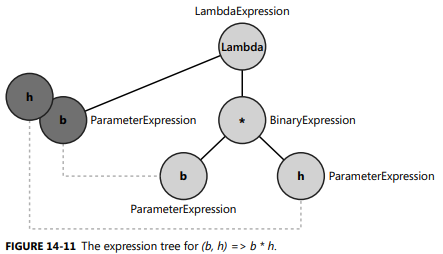
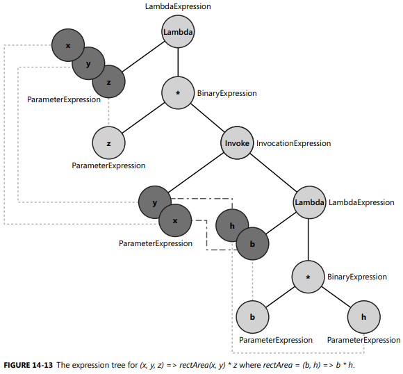
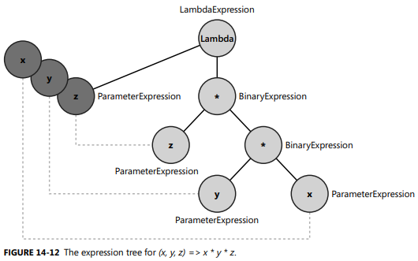
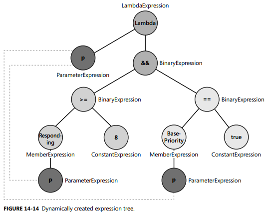

## Expression Trees

================================================

Source Code:

```C#
//---------------------------------------V
public class Expression<TDelegate> : LambdaExpression 
{
   public TDelegate Compile();  // get comipler to generate IL code that has the logic of the expression tree, it is like compiler writes a function for you
                                // this is probably the most concise, stratforward and important explanation
                                
   public TDelegate Compile(bool preferInterpretation);
   public TDelegate Compile(DebugInfoGenerator debugInfoGenerator);

   internal sealed override Type TypeCore => typeof(TDelegate);
   internal override Type PublicType => typeof(Expression<TDelegate>);

   public Expression<TDelegate> Update(Expression body, IEnumerable<ParameterExpression> parameters);
   protected internal override Expression Accept(ExpressionVisitor visitor);
}
//---------------------------------------Ʌ

//------------------------------------V
public abstract class LambdaExpression : Expression
{
   public Expression Body { get; }
   public ReadOnlyCollection<ParameterExpression> Parameters { get; }

   public sealed override ExpressionType NodeType => ExpressionType.Lambda;
   public Type ReturnType { get; }
   public bool TailCall { get; }
   public string Name { get; }

   public sealed override Type Type => TypeCore;
   internal abstract Type TypeCore { get; }       // Expression<TDelegate> will override it, which explains how InvocationExpression works, see a concrete example in later section

   public Delegate Compile();
   public Delegate Compile(bool preferInterpretation);
   public Delegate Compile(DebugInfoGenerator debugInfoGenerator);

   protected internal override Expression Accept(ExpressionVisitor visitor)
   {
      return visitor.VisitLambda(this);
   }
}
//------------------------------------Ʌ

//-------------------------------------------------------------------------------V
public abstract class Expression 
{
   protected Expression();
   protected Expression(ExpressionType nodeType, Type type);

   public virtual ExpressionType NodeType { get; }
   public virtual Type Type { get; }   // check if it is sth legacy (don't need to understand the details), the take away is, it relys on Expression<TDelegate> to override Type

   public virtual bool CanReduce { get; }

   public static BinaryExpression Add(Expression left, Expression right)  // AddAssign, AddAssignChecked, AddChecked
   {
      return Add(left, right, null);
   }

   public static BinaryExpression Add(Expression left, Expression right, MethodInfo method) 
   {
      method = BinaryCoreCheck ("op_Addition", left, right, method);   // + operator gets compiled into a static method called op_Addition

      return ...;  // logic to make a new BinaryExpression instance
   }

   private static MethodInfo BinaryCoreCheck(string oper_name, Expression left, Expression right, MethodInfo method) 
   {
      // if (left == null) or (right == null) throw new ArgumentNullException
      if (method != null)
      {
         if (method.ReturnType == typeof (void))
            throw new ArgumentException ("Must have only two parameters", "method");
         
         if (!method.IsStatic)
            throw new ArgumentException ("Method must be static", "method");
         var parameters = method.GetParameters();

         if (parameters.Length != 2)
				throw new ArgumentException ("Must have only two parameters", "method");

         if (!IsAssignableToParameterType (left.Type, parameters [0]))
            throw new InvalidOperationException ("left-side argument type does not match left expression type");
         
         if (!IsAssignableToParameterType (right.Type, parameters [1]))
            throw new InvalidOperationException ("right-side argument type does not match right expression type");
         
         return method;   // <-------------------------------
      } 
      else {
         if (oper_name != null) 
         {
            method = GetBinaryOperator(oper_name, ultype, left, right);
            if (method != null)
               return method;
         }

         // ...
      }
   }

   static MethodInfo GetBinaryOperator(string oper_name, Type on_type, Expression left, Expression right)
	{
		 MethodInfo [] methods = on_type.GetMethods(PublicStatic);

		 foreach (var method in methods) {
			 if (method.Name != oper_name)
				 continue;

			 var parameters = method.GetParameters ();
			 if (parameters.Length != 2)
				 continue;

			 if (method.IsGenericMethod)
				 continue;

			 if (!IsAssignableToParameterType (left.Type, parameters [0]))
				 continue;

			 if (!IsAssignableToParameterType (right.Type, parameters [1]))
				 continue;

				return method;
		 }

		 return null;
	}

   public static Expression<TDelegate> Lambda<TDelegate>(Expression body, params ParameterExpression[] parameters);  // <------------
  
   public static BinaryExpression And(Expression left, Expression right);  // AndAlso, AndAssign

   public static BinaryExpression Or(Expression left, Expression right);

   public static BinaryExpression Multiply(Expression left, Expression right);

   // you might wonder why we need to use `method` here since we already have ExpressionType info which can be  ExpressionType.Add (+) e.g
   // the reason we pass method is, we can overload + operator for custom class `public class Foo { public static Foo operator +(Foo x, Foo y) => new Foo(); }`
   public static BinaryExpression MakeBinary(ExpressionType binaryType, Expression left, Expression right, bool liftToNull, MethodInfo method);  // <---------------
   
   public static IndexExpression ArrayAccess(Expression array, IEnumerable<Expression> indexes);

   public static ConditionalExpression Condition(Expression test, Expression ifTrue, Expression ifFalse);

   public static MethodCallExpression Call(MethodInfo method, params Expression[] arguments);

   public static MethodCallExpression Call(Expression instance, MethodInfo method, Expression arg0, Expression arg1)  // instance is null for static method
   {
       ParameterInfo[] pis = ValidateMethodAndGetParameters(instance, method);
       ValidateArgumentCount(method, ExpressionType.Call, 2, pis);
       arg0 = ValidateOneArgument(method, ExpressionType.Call, arg0, pis[0], nameof(method), nameof(arg0));
       arg1 = ValidateOneArgument(method, ExpressionType.Call, arg1, pis[1], nameof(method), nameof(arg1));

       if (instance != null)
          return new InstanceMethodCallExpression2(method, instance, arg0, arg1);
      
       return new MethodCallExpression2(method, arg0, arg1);
   }

   public static UnaryExpression Quote(Expression expression)
   {
      LambdaExpression lambda = expression as LambdaExpression;

      return new UnaryExpression(ExpressionType.Quote, lambda, lambda.PublicType, null);
   }


   public static MethodCallExpression ArrayIndex(Expression array, IEnumerable<Expression> indexes);

   //-----------V
   public static InvocationExpression Invoke(Expression expression, IEnumerable<Expression> arguments)   // see an example in later section
   {   
      IReadOnlyList<Expression> argumentList = arguments.ToReadOnly();
      switch (argumentList.Count) {
         case 0:
            return Invoke(expression);
         case 1:
            return Invoke(expression, argumentList[0]);
         case 2:
            return Invoke(expression, argumentList[0], argumentList[1]);
         // ...
         case 5:
            return Invoke(expression, argumentList[0], argumentList[1], argumentList[2], argumentList[3], argumentList[4]);
      }
      // ... return new InvocationExpressionN(...)
   }  

   internal static InvocationExpression Invoke(Expression expression, Expression arg0, Expression arg1)
   {
      MethodInfo method = GetInvokeMethod(expression);
      // ...
      arg0 = ValidateOneArgument(method, ExpressionType.Invoke, arg0, pis[0], nameof(expression), nameof(arg0));  // just do some validation, not modify/reassign arg0
      arg1 = ValidateOneArgument(method, ExpressionType.Invoke, arg1, pis[1], nameof(expression), nameof(arg1));

      return new InvocationExpression2(expression, method.ReturnType, arg0, arg1);
   }

   internal static MethodInfo GetInvokeMethod(Expression expression)  // gets the delegate's Invoke method; used by InvocationExpression
   {
       Type delegateType = expression.Type;
       // ...
       return delegateType.GetInvokeMethod();
   }

   internal sealed class InvocationExpression2 : InvocationExpression
   {
      private object _arg0;  // storage for the 1st argument or a read-only collection
      private readonly Expression _arg1;  // storage for the 2nd argument

      public InvocationExpression2(Expression lambda, Type returnType, Expression arg0, Expression arg1) : base(lambda, returnType)
      {
         _arg0 = arg0;
         _arg1 = arg1;
      }

      public override Expression GetArgument(int index) 
      {
         switch (index) {
            case 0:
               return ExpressionUtils.ReturnObject<Expression>(_arg0);
            case 1:
               return  _arg1;
            case _:
               throw new ArgumentOutOfRangeException(nameof(index));          
         }
      }

      internal override InvocationExpression Rewrite(Expression lambda, Expression[]? arguments)
      {
         if (arguments != null)
         {
            return Expression.Invoke(lambda, arguments[0], arguments[1]);
         }

         return Expression.Invoke(lambda, ExpressionUtils.ReturnObject<Expression>(_arg0), _arg1);
      }
      // ...
   }
   //-----------Ʌ
   public static ConstantExpression Constant(object value);
   // ...

   public override string ToString();
   public virtual Expression Reduce();

   protected internal virtual Expression Accept(ExpressionVisitor visitor);   //<------------------------------
   protected internal virtual Expression VisitChildren(ExpressionVisitor visitor);
}
//-------------------------------------------------------------------------------Ʌ

public enum ExpressionType 
{
   Add, AddChecked, And, ArrayIndex,
   Call, Coalesce, Conditional, Constant,
   Divide, Equal, GreaterThan, GreaterThanOrEqual, 
   Invoke, Lambda, IsTrue, IsFalse,
   Multiply, Modulo, 
   Quote  // represents an expression that has a constant value of type Expression
   // ...
}
```

```C#
//---------------------------V
public class BinaryExpression : Expression
{
   internal BinaryExpression(Expression left, Expression right) 
   {
      Left = left;
      Right = right;
   }
   
   public Expression Left { get; }
   public Expression Right { get; }
   public MethodInfo Method { get; }

   public sealed override ExpressionType NodeType { get; }  // can be a lot of different ExpressionType such as Add, Divide

   public LambdaExpression Conversion => GetConversion();
   internal virtual LambdaExpression GetConversion() => null;

   public bool IsLifted { get; }
   public bool IsLiftedToNull { get; }
   
   protected internal override Expression Accept(ExpressionVisitor visitor) 
   {
      return visitor.VisitBinary(this);
   }

   public BinaryExpression Update(Expression left, LambdaExpression conversion, Expression right)
   {
      if (left == Left && right == Right && conversion == Conversion)
      {
         return this;
      }

      if (IsReferenceComparison) 
      {
         if (NodeType == ExpressionType.Equal)
         {
            return Expression.ReferenceEqual(left, right);
         }
         else
         {
            return Expression.ReferenceNotEqual(left, right);
         }
      }

      return Expression.MakeBinary(NodeType, left, right, IsLiftedToNull, Method, conversion);
   }
}
//---------------------------Ʌ

public class MethodCallExpression : Expression, IArgumentProvider
{
   public ReadOnlyCollection<Expression> Arguments { get; }
   public MethodInfo Method { get; }
   public sealed override ExpressionType NodeType { get; }
   public sealed override Type Type { get; }

   public Expression Object { get; }   // returned Expression represents the instance for instance method calls or null for static method calls.

   public MethodCallExpression Update(Expression @object, IEnumerable<Expression> arguments);
   // ...

   public interface IArgumentProvider {
      int ArgumentCount { get; }
      Expression GetArgument(int index);
   }
}

// InvocationExpression lets you provides arguments to another Expression which has its own arguments, which create a parameter mapping, you will see a concrete example
public sealed class InvocationExpression : Expression, IArgumentProvider
{
   internal InvocationExpression(Expression expression, Type returnType) 
   {
      Expression = expression;
      Type = returnType;
   }
   
   public Expression Expression { get; }

   public ReadOnlyCollection<Expression> Arguments => GetOrMakeArguments();

   internal virtual ReadOnlyCollection<Expression> GetOrMakeArguments()   // for subclass such as InvocationExpression2 to override
   {
      throw ContractUtils.Unreachable;
   }

   public virtual Expression GetArgument(int index)
   {
      throw ContractUtils.Unreachable;
   }
   
   public sealed override ExpressionType NodeType { get; }

   public sealed override Type Type { get; }

   public InvocationExpression Update(Expression expression, IEnumerable<Expression> arguments);
}

//-------------V
internal sealed class InvocationExpression2 : InvocationExpression
{
   private object _arg0;  // storage for the 1st argument or a read-only collection
   private readonly Expression _arg1;  // storage for the 2nd argument

   public InvocationExpression2(Expression lambda, Type returnType, Expression arg0, Expression arg1) : base(lambda, returnType)
   {
      _arg0 = arg0;
      _arg1 = arg1;
   }

   internal override ReadOnlyCollection<Expression> GetOrMakeArguments();

   public override Expression GetArgument(int index) 
   {
      switch (index) {
         case 0:
            return ExpressionUtils.ReturnObject<Expression>(_arg0);
         case 1:
            return  _arg1;
         case _:
            throw new ArgumentOutOfRangeException(nameof(index));           
      }
   }
   // ...

}
//-------------Ʌ

public class ConditionalExpression : Expression 
{
   public Expression IfFalse { get; }
   public Expression IfTrue { get; }
   public Expression Test { get; }

   public ConditionalExpression Update(Expression test, Expression ifTrue, Expression ifFalse);
}

public class ConstantExpression : Expression
{
   public object Value { get; }

   public sealed override ExpressionType NodeType { get; }  // always ExpressionType.Constant
}

public class ParameterExpression : Expression
{
   public bool IsByRef { get; }
   public string Name { get; }
}
```

You might wonder why `MethodCallExpression` and `InvocationExpression` Arguments are `ReadOnlyCollection<Expression>` not `ReadOnlyCollection<ParameterExpressionression>` just as `LambdaExpression`'s Parameters:

```C#
public abstract class LambdaExpression : Expression
{
   public Expression Body { get; }
   public ReadOnlyCollection<ParameterExpression> Parameters { get; }
   // ...
}

public class MethodCallExpression : Expression, IArgumentProvider 
{
   public Expression Object { get; }
   public ReadOnlyCollection<Expression> Arguments { get; }
   // ...
}

public sealed class InvocationExpression : Expression, IArgumentProvider
{
   public Expression Expression { get; }
   public ReadOnlyCollection<Expression> Arguments { get; }
}
```

The reason is , if you make `MethodCallExpression`'s Arguments to be `ReadOnlyCollection<ExpParameterExpressionression>`:

```C#
Expression<Action<string>> expr = p => Console.WriteLine(p);  // OK

Expression<Action<string>> expr = p => Console.WriteLine("Hello " + p);  // doesn't work, because `"Hello " + p` forms a `BinaryExpression`
```


## Visiting an Expression Tree

```C#
public abstract class ExpressionVisitor
{
   public virtual Expression Visit(Expression node) 
   {
      return node.Accept(this);
   }

   protected internal virtual Expression VisitLambda<T>(Expression<T> node)
   {
      Expression body = Visit(node.Body);

      if (body != node.Body) 
      {
         return Expression.Lambda(node.Type, body, node.Parameters);
      }

      return node;
   }
   //-----------------------------------V
   protected internal virtual Expression VisitBinary(BinaryExpression node) 
   {
      return ValidateBinary(
         node,
         node.Update(        
            Visit(node.Left),  // call Left node and right node recursively, this is important as it really visits all nodes thoroughly
            VisitAndConvert(node.Conversion, nameof(VisitBinary)),
            Visit(node.Right)
         )
      );
   }

   private static BinaryExpression ValidateBinary(BinaryExpression before, BinaryExpression after)
   {
      if (before != after && before.Method == null)
      {
         if (after.Method != null)
         {
            throw Error.MustRewriteWithoutMethod(after.Method, nameof(VisitBinary));
         }
 
         ValidateChildType(before.Left.Type, after.Left.Type, nameof(VisitBinary));
         ValidateChildType(before.Right.Type, after.Right.Type, nameof(VisitBinary));
      } 
      return after;
   }
   //-----------------------------------Ʌ
   
   protected internal virtual Expression VisitInvocation(InvocationExpression node)
   {
      Expression e = Visit(node.Expression);
      Expression[]? a = VisitArguments(node);
      if (e == node.Expression && a == null)
      {
         return node;
      }

      return node.Rewrite(e, a);  // the base call throws an Unreachable exception, but in reality the node is actually `InvocationExpressionN` which override Rewrite
   }

   // leaf nodes do not require another instance of Visit or code to check whether an internal node has been changed
   protected internal virtual Expression VisitConstant(ConstantExpression node) 
   {
      return node;
   }

   protected internal virtual Expression VisitParameter(ParameterExpression node)
   {
      return node;
   }

   protected internal virtual Expression VisitConditional(ConditionalExpression node);
   // ...
}
```

Note that XXExpression e.g `BinaryExpression` has many subtype, when you call Expression static api, most of time it doesn't create a baseclass of `XXXExpression` instance directly, intead, it create subtype instance such as `SimpleBinaryExpression`, `MethodCallExpression2`, `MethodCallExpression3` etc

A quick recap on Visitor Pattern:

```C#
public abstract class Fruit { }
public class Orange : Fruit { }
public class Apple : Fruit { }
public class Banana : Fruit { }

var fruits = new Fruit[] { new Orange(), new Apple(), new Banana(), new Banana(), new Banana(), new Orange() };

List<Orange> oranges = new List<Orange>();
List<Apple> apples = new List<Apple>();
List<Banana> bananas = new List<Banana>();

foreach (Fruit fruit in fruits)
{
    if (fruit is Orange)
        oranges.Add((Orange)fruit);
    else if (fruit is Apple)
        apples.Add((Apple)fruit);
    else if (fruit is Banana)
        bananas.Add((Banana)fruit);
}

/* some problems
1. not an elegant approach
2. not type-safe, we won't catch type errors until runtime
3. not maintainable, if add a new Fruit type, need to search every place that perform type-test , very easy to miss without assistance of the compiler
*/
```

Vistor Pattern approach:

```C#
interface IFruitVisitor
{
   void Visit(Orange fruit);
   void Visit(Apple fruit);
   void Visit(Banana fruit);
}

public abstract class Fruit { public abstract void Accept(IFruitVisitor visitor); }
public class Orange : Fruit { public override void Accept(IFruitVisitor visitor) { visitor.Visit(this); } }
public class Apple : Fruit { public override void Accept(IFruitVisitor visitor) { visitor.Visit(this); } }
public class Banana : Fruit { public override void Accept(IFruitVisitor visitor) { visitor.Visit(this); } }

class FruitPartitioner : IFruitVisitor
{
    public List<Orange> Oranges { get; private set; }
    public List<Apple> Apples { get; private set; }
    public List<Banana> Bananas { get; private set; }

    public FruitPartitioner()
    {
        Oranges = new List<Orange>();
        Apples = new List<Apple>();
        Bananas = new List<Banana>();
    }

    public void Visit(Orange fruit) { Oranges.Add(fruit); }
    public void Visit(Apple fruit) { Apples.Add(fruit); }
    public void Visit(Banana fruit) { Bananas.Add(fruit); }
}

FruitPartitioner partitioner = new FruitPartitioner();

foreach (Fruit fruit in fruits)
{
    fruit.Accept(partitioner);
}
```


#### Dissecting Expression Trees

```C#
Expression<Func<int, int>> lambdaInc = (n) => n + 1;

Func<int, int> lambda = lambdaInc.Compile();   // calling Compile() generates the Intermediate Language (IL) code to implement the behavior described by the visiting nodes
                                               // Visiting nodes using `ExpressionVisitor` will be covered in the next section
int num = lambda(3);

int  num = lambdaInc.Compile()(3);
```

 => n + 1")

Let's first see how compiler Generates an Expression Tree for you. When you use `Expression<Func<int, int>> lambdaInc = (n) => n + 1`, compiler does the following equivalent:

```C#
ConstantExpression constant = Expression.Constant(1, typeof(int));
ParameterExpression parameter = Expression.Parameter(typeof(int), "n");
BinaryExpression addBinaryExpression = Expression.Add( parameter, constant );

Expression<Func<int, int>> exprInc = Expression.Lambda<Func<int, int>>(addBinaryExpression, new ParameterExpression[] { parameter } );
```

`exprInc` points to the `LambdaExpression` node, to create a non-LambdaExpression node, you need to use Expression's static methods API such as `Add()`, `MakeBinary()` etc.

You can't assign a already-defined delegate to `Expression<T>` as:

```C#
Expression<Action<string>> exp = p => Console.WriteLine(p);  // OK

Action<string> action = p => Console.WriteLine(p);
Expression<Action<string>> exp = action;   // doesn't compile, cannot implicitly convert Action<String> to Expression<Action<string>>
```

Note that the nodes of an expression tree are immutable, as `Expression`'s properties are read-only ( e.g `public Expression Left { get; }`, no setter), let's say you want to change the constant 1 to 10 in the (n) => n + 1 example above:

```C#
Expression<int, int> lambdaInc = (n) => n + 1;

// wrong approach
Expression body = lambdaInc.Body;
ConstantExpression constant = top.Right() as ConstantExpression;
constant.Value = 5;  // compiler error - Value is a read-only property

// correct approach
Expression body = lambdaInc.Body;
ConstantExpression newRight = Expression.Constant(10);
Expression newTree = Expression.MakeBinary(body.NodeType, body.Left, newRight);
```


## How Compiler Handler Local Variable

Let's look at a very simple example:

```C#
static void Main(string[] args) 
{
   Expression<Func<string>> expr = () => "Hello";

   // this section shows how the expression trees like internally
   var a = (LambdaExpression)expr;
   var b = (ConstantExpression)a.Body;
   var result = (string)b.Value;
   //
}
```

 => 'Hello'")

Let's see how compiler handler local variable when constructing `Expression<T>` instance:

```C#
static void Main(string[] args) 
{
   string str = "Hello";

   //
   Expression<Func<string>> expr = () => str;
   //

   //
   var a = (LambdaExpression)expr;

   var b = (MemberExpression)a.Body;

   MemberInfo memberinfo = b.Member;   // memberinfo is a "str" field that belongs to a class generated by the compiler as you can see below

   var c = (ConstantExpression)b.Expression;

   object d = c.Value;  // d is {ConsoleAppLinqToSQL.Program.<>c__DisplayClass0_0} object instance that has a str field of "Hello"
                        // looks like compile create an instance of <>c__DisplayClass0_0 class (that constains str field)
                        // technically, you can get "Hello" by casting `d` to `<>c__DisplayClass0_0` and access str field, however since the class
                        // generated by the compiler, you can't actually acquire it
   //

   // --------------------------------------------------------------------------------
   object result = ((FieldInfo)memberinfo).GetValue(d);  // result is string "Hello"

   Console.WriteLine(expr);  // () => value(ConsoleAppLinqToSQL.Program+<>c__DisplayClass0_0).str
                             // note that "value(...)" is associated with MemberExpression,
}
```

Now it should be clear to you what happen how compiler "inject" local variable into `Expression<T>` instance:

1. a class is created by compiler and this class has the field whose name match to the local variable's name

2. compiler create an instance of this class, the instance is wrapped into a `ConstantExpression`

3. a `MemberExpression` is created whose `Expression` property set to the `ConstantExpression` instance and `Member` property set to the dynamicalkly created class's field

4. `LambdaExpression` instance created with `Body` property set to a `MemberExpression` instance

Note that you can't get local variable's value via `ConstantExpression`, you have to use reflection to get the value as explained in the code above

 => str")


-------------------------------------------------------------------------------------------------------------------------------------
#### Modifying Expression Trees using `ExpressionVisitor`

In this section, we'll be looking into 3 examples (starting from easy to difficult levels ) to gain a better understanding on `ExpressionVisitor`

**Example One**

Let's say you want to change the logic `&&` to `||` as:

```C#
// before
Func<string, bool> expr = name => name.Length > 10 && name.StartsWith("G");

//after
Func<string, bool> expr = name => name.Length > 10 || name.StartsWith("G");
```

Solution:

```C#
public class AndAlsoModifier : ExpressionVisitor
{
   public Expression Modify(Expression expression) 
   {
      return Visit(expression);   // <-------------------------1.1, expression here is LambdaExpression        
   }

   protected override Expression VisitBinary(BinaryExpression b) // <---------------2.2a 
   {
      if (b.NodeType == ExpressionType.AndAlso)
      {
          Expression left = this.Visit(b.Left);   // // call Visit() on its left and right nodes recursively
          Expression right = this.Visit(b.Right); 

           return Expression.MakeBinary(ExpressionType.OrElse, left, right, b.IsLiftedToNull, b.Method);
      }

      return base.VisitBinary(b);  // let you visit all the nodes thoroughly, there could be another "AndAlso" binary exp in a deep nested level if we make our exapmle complicated
                                   // if you don't call base method, you will end up with only changes the first "AndAlso" binary exp visited, and missing other potential nodes
   }
}

Expression<Func<string, bool>> expr = name => name.Length > 10 && name.StartsWith("G");  
Console.WriteLine(expr);  

AndAlsoModifier treeModifier = new AndAlsoModifier();  
Expression modifiedExpr = treeModifier.Modify((Expression) expr);   // <---------------1

Console.WriteLine(modifiedExpr);  

/* 
    name => ((name.Length > 10) && name.StartsWith("G"))  
    name => ((name.Length > 10) || name.StartsWith("G"))  
*/  
```

Let's analyse the code with `ExpressionVisitor`:

```C#
public abstract class ExpressionVisitor
{
   public virtual Expression Visit(Expression node) 
   {
      return node.Accept(this);   // <-------------------------1.2a; 2.1a
   }

   protected internal virtual Expression VisitLambda<T>(Expression<T> node)
   {
      Expression body = Visit(node.Body);   // <--------------1.3_   node.Body is BinaryExpression that represent name => ((name.Length > 10) && name.StartsWith("G"))

      if (body != node.Body)
      {
         return Expression.Lambda(node.Type, body, node.Parameters);
      }

      return node;
   }

   protected internal virtual Expression VisitBinary(BinaryExpression node)  // is override by AndAlsoModifier, but will still be called conditionally
   {
      return ValidateBinary(    
         node,
         node.Update(         
            Visit(node.Left), 
            VisitAndConvert(node.Conversion, nameof(VisitBinary)),
            Visit(node.Right)
         )
      );
   }

   // this method is not very important, just do some validation check and return the modified node
   private static BinaryExpression ValidateBinary(BinaryExpression before, BinaryExpression after)
   {
      if (before != after && before.Method == null)
      {
         if (after.Method != null)
         {
            throw Error.MustRewriteWithoutMethod(after.Method, nameof(VisitBinary));
         }
 
         ValidateChildType(before.Left.Type, after.Left.Type, nameof(VisitBinary));
         ValidateChildType(before.Right.Type, after.Right.Type, nameof(VisitBinary));
      } 
      return after;
   }
   // ...
}

public abstract class LambdaExpression : Expression
{
   public Expression Body { get; }
   public ReadOnlyCollection<ParameterExpression> Parameters { get; }

   protected internal override Expression Accept(ExpressionVisitor visitor)  // <------------1.2b
   {
      return visitor.VisitLambda(this);   
   }
   // ...
}

public class BinaryExpression : Expression
{
   // ...
   protected internal override Expression Accept(ExpressionVisitor visitor)  // <---------------2.1b
   {
      return visitor.VisitBinary(this);
   }

   public BinaryExpression Update(Expression left, LambdaExpression conversion, Expression right)  // <---------------2.2b, return original node or construct a new node
   {
      if (left == Left && right == Right && conversion == Conversion)
      {
         return this;
      }

      if (IsReferenceComparison) 
      {
         if (NodeType == ExpressionType.Equal)
         {
            return Expression.ReferenceEqual(left, right);
         }
         else
         {
            return Expression.ReferenceNotEqual(left, right);
         }
      }

      return Expression.MakeBinary(NodeType, left, right, IsLiftedToNull, Method, conversion);
   }
}
```

**Example Two**

Let's say you want to use existing expression tree `rectArea` in a new expression:

```C#
Expression<Func<double, double, double>> rectArea = (b, h) => b * h;   // b, h parameter names are chosen (not x, y as usual) with purpose as you will see 
```


and you want to calculate volumn, you could do:

```C#
Expression<Func<double, double, double, double >> volume = (x, y, z) => x * y * z;
```

and you want to use `rectArea` with volume somehow as:

```C#
Expression<Func<double, double, double, double >> volume = (x, y, z) => rectArea(x, y) * z;  // doesn't compile, of course

Expression<Func<double, double, double, double >> volume = (x, y, z) => rectArea.Compile()(x, y) * z;  // compile, but have an extra InvocationExpression node as below picture: 
```


which is not what we really want, what we want is:




So how can we remove the `InvocationExpression` node? It will be very difficulty to remove this node since expression trees are immutable, which means you need to manullay create new expression, which is tedious and error-prone, there is a better way to do it with `ExpressionVisitor`:

Firstly, let's start with the exising `rectArea` and build the expression tree that has extra `InvocationExpression` node:

```C#
Expression<Func<double, double, double>> rectArea = (b, h) => b * h;

ParameterExpression x = Expression.Parameter(typeof(double), "x" );
ParameterExpression y = Expression.Parameter(typeof(double), "y");
ParameterExpression z = Expression.Parameter(typeof(double), "z");
Expression area = Expression.Invoke(rectArea, new Expression[] { x, y });

BinaryExpression multiply = Expression.Multiply(z, area);
Expression<Func<double, double, double, double>> volume = Expression.Lambda<Func<double, double, double, double>>(multiply, new ParameterExpression[] { x, y, z });

Console.WriteLine("Area   = {0}", rectArea.ToString());
Console.WriteLine("Volume = {0}", volume.ToString());
Console.WriteLine("Area value   = {0}", rectArea.Compile()(20, 10));
Console.WriteLine("Volume value = {0}", volume.Compile()(20, 10, 8));

/*
Area   = (b, h) => (b * h)
Volume = (x, y, z) => (z * Invoke((b, h) => (b * h),x,y))   // (b, h) => (b * h) is an Expression, so it's like Invoke(ContainningExpression,x,y)
Area value   = 200
Volume value = 1600
*/
```

The second step is to obtain the expression tree which is what we want without the extra `InvocationExpression` node by using `ExpressionVisitor`:

```C#
public class RemoveInvokeVisitor<T> : ExpressionVistor
{
   protected override Expression VisitInvocation(InvocationExpression invocExpr) {
      ReadOnlyCollection<Expression> newParams = invocExpr.Arguments;   // newParams is ParameterExpression x, y, z
      LambdaExpression lambda = invocExpr.Expression as LambdaExpression;
      if (lambda != null)
      {
         ReadOnlyCollection<ParameterExpression> oldParams = lambda.Parameters;
         ReplaceParametersVisitor replace = new ReplaceParametersVisitor(oldPars, newPars);

         // the design of this return is very important, it is not like traditional pattern that VisitXXX and return XXX expression, 
         // now it is like VisitXXX (XXX is InvocationExpression) and return YYY (YYY is BinaryExpression)
         return replace.ReplaceVisit(lambda.Body);  // returns a newBinaryExpression, not a new InvocationExpression, which is our purpose to "remove" invocation
                                                    // lambda.Body is old BinaryExpression (b*h), newBinaryExpression is (x *y)
      } else {
         return base.VisitInvocation(iv);
      }
   }

   public Expression<T> RemoveInvokeVisit(Expression<T> exp) {
      return (Expression<T>) Visit(exp);
   }
}

public class ReplaceParametersVisitor : ExpressionVistor
{
   private ReadOnlyCollection<Expression> newParameters;
   private ReadOnlyCollection<ParameterExpression> oldParameters;

   public ReplaceParametersVisitor(ReadOnlyCollection<ParameterExpression> oldParameters, ReadOnlyCollection<Expression> newParameters)
   {
      this.newParameters = newParameters;
      this.oldParameters = oldParameters;
   }

   protected override Expression VisitParameter(ParameterExpression p)
   {
      if (oldParameters != null && newParameters != null)
      {
         if (oldParameters.Contains(p))
         {
            return newParameters[oldParameters.IndexOf(p)];
         }
      }

      return base.VisitParameter(p);
   }

   // only visits child/grandchild nodes (BinaryExpression b*h in this example) of InvocationExpression exp
   public Expression ReplaceVisit(Expression exp)  // exp is BinaryExpression (b*h)
   {
      return Visit(exp);   // returns a new BinaryExpression if we find what we want to remove/modify
   }
}

// note that even this visitor is called ReplaceParametersVisitor, part of its job is to return new BinaryExpression from its ReplaceVisit method
```

```C#
// ...
var cleaner =new RemoveInvokeVistor<Func<double, double, double, double>>();

Expression<Func<double, double, double, double>> cleanVolume = cleaner.RemoveInvokeVisit(volume);  //  now it's (x, y, z) => (z * (x * y))
```


**Example Three: Dynamic Composition of an Expression Tree**

This is the most important part in regards to create an Expression Tree dynamically. . For example, an user makes some choices through the user interface to filter data to
be queried. You might think we can use LINQ's `Where` to do the job without Expression Tree, the problem is that a class can have a lot of properties, each properties might be non-primitive type, so are you going to write endless `Where` to do the job? That's why Expression Tree kicks in, let's see an concrete example, let's say you want to query ` System.Diagnostic.Process` so you can do `p => (p.Responding == True) && (p.BasePriority > 8)`:

```C#
public class ProcessFilters
{
   ParameterExpression paramExp;
   Expression bodyFilter;

   public ProcessFilters()
   {
      paramExp = Expression.Parameter(typeof(Process), "p");
      bodyFilter = null;
   }

   public Expression<Func<Process, bool>> GetExpression()
   {
      if (bodyFilter == null)
      {
         return null;
      }

      Expression<Func<Process, bool>> filter = Expression.Lambda<Func<Process, bool>>(bodyFilter, new ParameterExpression[] { paramExp });
      return filter;
   }

   public void Add(string fieldName, ExpressionType comparisonOperator, object comparisonValue)
   {
      switch (comparisonOperator)
      {
         case ExpressionType.Equal:
         case ExpressionType.NotEqual:
         case ExpressionType.LessThan:
         case ExpressionType.LessThanOrEqual:
         case ExpressionType.GreaterThan:
         case ExpressionType.GreaterThanOrEqual:
            // supported operations                 
            break;
         default:
            throw new NotSupportedException(String.Format("Operator {0} is not supported in ProcessFilters.Add", comparisonOperator.ToString()));
      }

      ConstantExpression comparisonConstant = Expression.Constant(comparisonValue, comparisonValue.GetType());

      MemberExpression fieldAccess = Expression.Property(paramExp, fieldName);

      BinaryExpression comparison = Expression.MakeBinary(comparisonOperator, fieldAccess, comparisonConstant);

      if (bodyFilter == null)
      {
         bodyFilter = comparison;
      }
      else
      {
         bodyFilter = Expression.AndAlso(bodyFilter, comparison);
      }
   }
}
```

```C#
static void Main(string[] args)
{
   ProcessFilters pf = new ProcessFilters();

   // depends on user selection, we can use Reflection to list all properties on GUI for users to choose and capture users' inputs
   pf.Add("Responding", ExpressionType.Equal, true);        // simulate users' selection
   pf.Add("BasePriority", ExpressionType.GreaterThan, 8);   // simulate users' selection

   Expression<Func<Process, bool>> filterExpression = pf.GetExpression();

   if (filterExpression == null)
   {
      filterExpression = (p) => true;
   }

   Console.WriteLine("Filter : {0}", filterExpression.ToString());

   var query =
      Process.GetProcesses().AsQueryable()
      .Where(filterExpression)
      .Select(p => p.ProcessName);

   foreach (var row in query)
      Console.WriteLine(row);
}

/*
Filter : p => ((p.Responding == True) AndAlso (p.BasePriority > 8)) 
smss 
csrss 
wininit 
winlogon 
csrss 
dwm 
lsass 
msvsmon 
services
*/
```




## Use Expression.Quote() to Wrap LambdaExpression

Difference between `UnaryExpression` and `ConstantExpression`:
https://stackoverflow.com/questions/3138133/what-is-the-purpose-of-linqs-expression-quote-method
https://stackoverflow.com/questions/3716492/what-does-expression-quote-do-that-expression-constant-can-t-already-do/3753382#3753382

```C#
/* nested lambda
(int s) => (int t) => s+t  
*/

var ps = Expression.Parameter(typeof(int), "s");
var pt = Expression.Parameter(typeof(int), "t");

//
var ex1 = Expression.Lambda(
             Expression.Lambda(
                Expression.Add(ps, pt),
             pt),
          ps);

var f1a = (Func<int, Func<int, int>>)ex1.Compile();   // OK
var f1b = f1a(100);
Console.WriteLine(f1b(123));

// now let's say we want to represent: (int s) => Expression.Lambda(Expression.Add(...
var ex2 = Expression.Lambda(
             Expression.Quote(   // <------------- have to use Expression.Quote
                Expression.Lambda(
                   Expression.Add(ps, pt),
                pt)
             ),
          ps);

var f2a = (Func<int, Expression<Func<int, int>>>)ex2.Compile();
Func<int, int> f2b = f2a(200).Compile();   // OK
Console.WriteLine(f2b(123));

var ex3 = Expression.Lambda(
             Expression.Constant(  // <------------- cannot use Expression.Constant
                Expression.Lambda(
                   Expression.Add(ps, pt),
                pt)
             ),
          ps);

var f3a = (Func<int, Expression<Func<int, int>>>)ex3.Compile();
var f3b = f3a(300).Compile();   // throws exception at Compile(): variable s of type System.Int32 is not defined 
// Console.WriteLine(f3b(123));   
```

Unlike a Constant node, the Quote node specially handles contained `ParameterExpression` nodes.  At run time when the Quote node is evaluated, it substitutes the
closure variable references for the `ParameterExpression` reference nodes, and then returns the quoted expression. Let's look at some examples:

```C#
// to implement: x => x + 1
ConstantExpression constant = Expression.Constant(1, typeof(int));
ParameterExpression parameter = Expression.Parameter(typeof(int), "x");

Expression<Func<int, int>> f = Expression.Lambda<Func<int, int>>(Expression.Add(parameter, constant), new ParameterExpression[] { parameter });

Console.WriteLine(f);   // x => x + 1
```

```C#
// to implement: x => y => (x + y)
ParameterExpression x = Expression.Parameter(typeof(int), "x");
ParameterExpression y = Expression.Parameter(typeof(int), "y");

Expression<Func<int, Expression>> f = Expression.Lambda<Func<int, Expression>>(
                                         Expression.Quote(  Expression.Lambda<Func<int, int>>(Expression.Add(x, y), new ParameterExpression[] { y })  ),
                                      new ParameterExpression[] { x });

Console.WriteLine(f);   // x => y => (x + y)
```

You can see that `Expression.Quote()` "pass" the outter lambda's x into inner lambda's x. Also compare `Expression<Func<int, int>> f` in first example and `Expression<Func<int, Expression>> f` in the second example, `Expression.Quote()` somehow force you call `Compile()` twice and plus one explicit casting e.g `((Expression<Func<int, int>>)f.Compile()(3)).Compile()(5)`

If you don't want to use `Expression.Quote()`, you can do:

```C#
ParameterExpression x = Expression.Parameter(typeof(int), "x");
ParameterExpression y = Expression.Parameter(typeof(int), "y");

Expression<Func<int, Func<int, int>>> f = Expression.Lambda<Func<int, Func<int, int>>>(
                                             Expression.Lambda<Func<int, int>>(Expression.Add(x, y), new ParameterExpression[] { y }),
                                          new ParameterExpression[] { x });

Console.WriteLine(f);   // x => y => (x + y)
```

## NewExpression

see the example of `ComplexObjectModelBinder`

```C#
public interface IArgumentProvider
{
   Expression GetArgument(int index);

   int ArgumentCount
   {
      get;
   }
}
```

```C#
//------------------------V
public class NewExpression : Expression, IArgumentProvider
{
   private IReadOnlyList<Expression> _arguments;
 
   internal NewExpression(ConstructorInfo? constructor, IReadOnlyList<Expression> arguments, ReadOnlyCollection<MemberInfo>? members)
   {
      Constructor = constructor;
      _arguments = arguments;
      Members = members;
   }

   public override Type Type => Constructor!.DeclaringType!;

   public sealed override ExpressionType NodeType => ExpressionType.New;

   public ConstructorInfo? Constructor { get; }

   public ReadOnlyCollection<Expression> Arguments => ExpressionUtils.ReturnReadOnly(ref _arguments);

   public Expression GetArgument(int index) => _arguments[index];

   public int ArgumentCount => _arguments.Count;

   public ReadOnlyCollection<MemberInfo>? Members { get; }

   protected internal override Expression Accept(ExpressionVisitor visitor)
   {
      return visitor.VisitNew(this);
   }

   public NewExpression Update(IEnumerable<Expression>? arguments)
   {
      if (ExpressionUtils.SameElements(ref arguments, Arguments))
      {
         return this;
      }
 
      return Members != null ? New(Constructor!, arguments, Members) : New(Constructor!, arguments);
   }
}
//------------------------Ʌ


//-----------------------------V
public partial class Expression
{
   public static NewExpression New(ConstructorInfo constructor)
   {
      return New(constructor, (IEnumerable<Expression>?)null);
   }

   public static NewExpression New(ConstructorInfo constructor, params Expression[]? arguments)
   {
      return New(constructor, (IEnumerable<Expression>?)arguments);
   }

   public static NewExpression New(ConstructorInfo constructor, IEnumerable<Expression>? arguments)
   {
      TypeUtils.ValidateType(constructor.DeclaringType!, nameof(constructor), allowByRef: true, allowPointer: true);
      ValidateConstructor(constructor, nameof(constructor));
      ReadOnlyCollection<Expression> argList = arguments.ToReadOnly();
      ValidateArgumentTypes(constructor, ExpressionType.New, ref argList, nameof(constructor));
 
      return new NewExpression(constructor, argList, null);
   }

   public static NewExpression New(ConstructorInfo constructor, IEnumerable<Expression>? arguments, IEnumerable<MemberInfo>? members)
   {
      TypeUtils.ValidateType(constructor.DeclaringType!, nameof(constructor), allowByRef: true, allowPointer: true);
      ValidateConstructor(constructor, nameof(constructor));
      ReadOnlyCollection<MemberInfo> memberList = members.ToReadOnly();
      ReadOnlyCollection<Expression> argList = arguments.ToReadOnly();
      ValidateNewArgs(constructor, ref argList, ref memberList);
      return new NewExpression(constructor, argList, memberList);
   }

   public static NewExpression New(Type type)
   {
      TypeUtils.ValidateType(type, nameof(type));
 
      ConstructorInfo? ci = type.GetConstructors(BindingFlags.Instance | BindingFlags.Public | BindingFlags.NonPublic).SingleOrDefault(c => c.GetParametersCached().Length == 0);
      
      if (ci != null)
      {
         return New(ci);
      }

      if (!type.IsValueType)
      {
         throw Error.TypeMissingDefaultConstructor(type, nameof(type));
      }

      return new NewValueTypeExpression(type, ReadOnlyCollection<Expression>.Empty, null);
   }

   private static void ValidateNewArgs(ConstructorInfo constructor, ref ReadOnlyCollection<Expression> arguments, ref ReadOnlyCollection<MemberInfo> members)
   {
      // ...
   }

   private static void ValidateAnonymousTypeMember(ref MemberInfo member, out Type memberType, string paramName, int index)
   {
      // ...
   }

   private static void ValidateConstructor(ConstructorInfo constructor, string paramName)
   {
      if (constructor.IsStatic)
         throw Error.NonStaticConstructorRequired(paramName);
   }
}
//-----------------------------Ʌ
```

<style type="text/css">
.markdown-body {
  max-width: 1800px;
  margin-left: auto;
  margin-right: auto;
}
</style>

<link rel="stylesheet" href="./zCSS/bootstrap.min.css">
<script src="./zCSS/jquery-3.3.1.slim.min.js"></script>
<script src="./zCSS/popper.min.js"></script>
<script src="./zCSS/bootstrap.min.js"></script>
