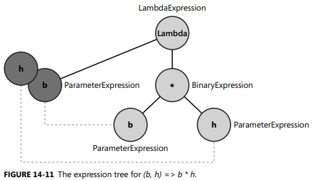
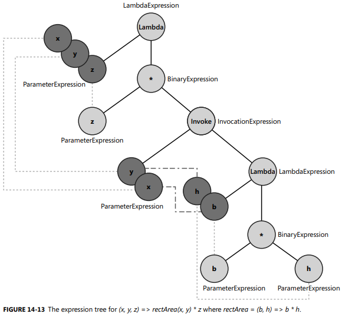
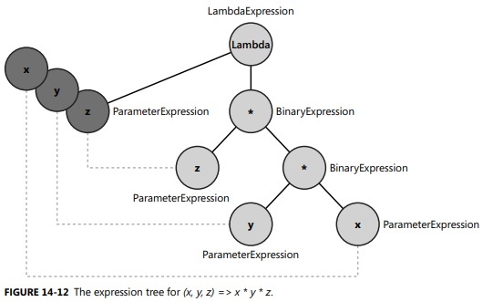
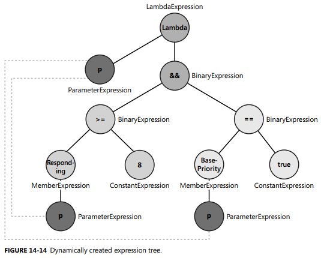

1-LINQ
==============================

## Source Code

```C#
//------------------------------------V
public static partial class Enumerable 
{
   public static IEnumerable<TSource> Where<TSource>(this IEnumerable<TSource> source, Func<TSource, bool> predicate);

   public static IEnumerable<TSource> Where<TSource>(this IEnumerable<TSource> source, Func<TSource, int, bool> predicate);  // using index is not supported by query expression

   public static IEnumerable<TResult> Select<TSource, TResult>(this IEnumerable<TSource> source, Func<TSource, TResult> selector) {
      if (source is Iterator<TSource> iterator) 
      {
         return iterator.Select(selector);
      }

      if (source is IList<TSource> ilist)
      {
         if (source is TSource[] array)
         {
            return array.Length == 0 ? Empty<TResult>() : new SelectArrayIterator<TSource, TResult>(array, selector);
         }

         if (source is List<TSource> list)
         {
            return new SelectListIterator<TSource, TResult>(list, selector);
         }

         return new SelectIListIterator<TSource, TResult>(ilist, selector);
      }

      return new SelectEnumerableIterator<TSource, TResult>(source, selector);
   }

   public static IEnumerable<TResult> SelectMany<TSource, TResult>(this IEnumerable<TSource> source, Func<TSource, IEnumerable<TResult>> selector);

   public static IEnumerable<TResult> SelectMany<TSource, TCollection, TResult>(this IEnumerable<TSource> source, 
                                                                                Func<TSource, IEnumerable<TCollection>> collectionSelector, 
                                                                                Func<TSource, TCollection, TResult> resultSelector);
   
   public static IEnumerable<TResult> Join<TOuter, TInner, TKey, TResult>(this IEnumerable<TOuter> outer, 
                                                                          IEnumerable<TInner> inner, 
                                                                          Func<TOuter, TKey> outerKeySelector,  
                                                                          Func<TInner, TKey> innerKeySelector, 
                                                                          Func<TOuter, TInner, TResult> resultSelector);

   //--------------------------------V    
   public static IEnumerable<IGrouping<TKey, TSource>> GroupBy<TSource, TKey>(this IEnumerable<TSource> source, Func<TSource, TKey> keySelector); 

   public static ILookup<TKey, TElement> ToLookup<TSource, TKey, TElement>(this IEnumerable<TSource> source, Func<TSource, TKey> keySelector);  // more advanced than GroupBy
  
   public interface ILookup<TKey, TElement> : IEnumerable<IGrouping<TKey, TElement>> 
   {
      int Count { get; }
      IEnumerable<TElement> this[TKey key] { get; }
      bool Contains(TKey key);
   }
   //--------------------------------Ʌ
   public static IEnumerable<TResult> GroupJoin<TOuter, TInner, TKey, TResult>(this IEnumerable<TOuter> outer, 
                                                                               IEnumerable<TInner> inner, 
                                                                               Func<TOuter, TKey> outerKeySelector,
                                                                               Func<TInner, TKey> innerKeySelector, 
                                                                               Func<TOuter, IEnumerable<TInner>, TResult> resultSelector);

   public static IOrderedEnumerable<TSource> OrderBy<TSource, TKey>(this IEnumerable<TSource> source, Func<TSource, TKey> keySelector);
   
   public static IOrderedEnumerable<TSource> OrderByDescending<TSource, TKey>(this IEnumerable<TSource> source, Func<TSource, TKey> keySelector); 
            
   public static IOrderedEnumerable<TSource> ThenBy<TSource, TKey>(this IOrderedEnumerable<TSource> source, Func<TSource, TKey> keySelector, IComparer<TKey>? comparer);   

   public static IOrderedEnumerable<TSource> ThenByDescending<TSource, TKey>(this IOrderedEnumerable<TSource> source, Func<TSource, TKey> keySelector, IComparer<TKey>? comparer);
                                                                  
   // ...
   public static IEnumerable<TSource> Take<TSource>(this IEnumerable<TSource> source, int count)
   {
      return count <= 0 ? Empty<TSource>() : TakeIterator<TSource>(source, count);   
   }

   public static bool All<TSource>(this IEnumerable<TSource> source, Func<TSource, bool> predicate) // Any works unexpected, it return true when source is null when source is empty
   {
      foreach (TSource element in source) {   // <------------------- if source is empty, it doesn't enumerate in foreach, so it return true, which we need to pay attention to 
         if (!predicate(element)) {
            return false;
         }
      }

      return true;
   }

   public static bool Any<TSource>(this IEnumerable<TSource> source, Func<TSource, bool> predicate)   // Any works expected when the source is empty
   {
      foreach (TSource element in source) {
         if (predicate(element)) {
            return true;
         }
      }

      return false;
   }

   public static IEnumerable<TSource> Distinct<TSource>(this IEnumerable<TSource> source, IEqualityComparer<TSource> comparer);  // check CLR via C# Walkthrough Chapter 5
 
   //--------------------------------V
   public static IEnumerable<TResult> Empty<TResult>()
   {
      return EmptyEnumerable<TResult>.Instance;
   }

   internal class EmptyEnumerable<TElement>
   {
      public static readonly TElement[] Instance = new TElement[0];
   }
   //--------------------------------Ʌ

   //--------------------------------V
   public IEnumerable<T> OfType<T>(this IEnumerable source)   // doesn't throw exception
   {
      foreach(object o in source) 
      {
         if(o is T) 
         {
            yield return (T) o;
         }     
      }
      
   }

   public IEnumerable<T> Cast<T>(this IEnumerable source) {  // throw exception when the curr item cannot be casted 
      foreach(object o in source) 
      {
         yield return (T) o;
      }        
   }
   //--------------------------------Ʌ

   public static TSource Aggregate<TSource>(this IEnumerable<TSource> source, Func<TSource, TSource, TSource> func)  // use first item in the list as starting point
   {
      using (IEnumerator<TSource> e = source.GetEnumerator()) 
      {
         if (!e.MoveNext())
            ThrowHelper.ThrowNoElementsException();

         TSource result = e.Current;
         while (e.MoveNext()) 
         {
            result = func(result, e.Current);   // e.Current is actually "next"
         }

         return result;  
      }
   }

   public static TAccumulate Aggregate<TSource, TAccumulate>(this IEnumerable<TSource> source, TAccumulate seed, Func<TAccumulate, TSource, TAccumulate> func)
   {
      TAccumulate result = seed;

      foreach (TSource element in source)
      {
         result = func(result, element);
      }

      return result;
   }

   public static TResult Aggregate<TSource, TAccumulate, TResult>(this IEnumerable<TSource> source, 
                                                                  TAccumulate seed, 
                                                                  Func<TAccumulate, TSource, TAccumulate> func, 
                                                                  Func<TAccumulate, TResult> resultSelector)     // doesn' look very useful
   {
      TAccumulate result = seed;
      
      foreach (TSource element in source) 
      {
         result = func(result, element);
      }

      return resultSelector(result);
   }
}
//------------------------------------Ʌ

//---------------------------------------VV
internal abstract class Iterator<TSource> : IEnumerable<TSource>, IEnumerator<TSource> 
{
   private readonly int _threadId;
   internal int _state;
   internal TSource _current = default!;

   protected Iterator() {
      _threadId = Environment.CurrentManagedThreadId;
   }

   public TSource Current => _current;

   public abstract Iterator<TSource> Clone();  // for scenarios that you need to enumerate the collection multiple times concurrently

   public virtual void Dispose()
   {
      _current = default!;
      _state = -1;
   }

   public IEnumerator<TSource> GetEnumerator() 
   {
      Iterator<TSource> enumerator = _state == 0 && _threadId == Environment.CurrentManagedThreadId ? this : Clone();
      enumerator._state = 1;
      return enumerator;
   }

   public abstract bool MoveNext();

   public virtual IEnumerable<TResult> Select<TResult>(Func<TSource, TResult> selector) 
   {
      return new SelectEnumerableIterator<TSource, TResult>(this, selector);
   }

   public virtual IEnumerable<TSource> Where(Func<TSource, bool> predicate)
   {
      return new WhereEnumerableIterator<TSource>(this, predicate);
   }

   object? IEnumerator.Current => Current;

   IEnumerator IEnumerable.GetEnumerator() => GetEnumerator();

   void IEnumerator.Reset() => ThrowHelper.ThrowNotSupportedException();
}
//---------------------------------------ɅɅ

//---------------------------------------------------------------V
private sealed partial class SelectListIterator<TSource, TResult> : Iterator<TResult> 
{
   private readonly List<TSource> _source;
   private readonly Func<TSource, TResult> _selector;
   private List<TSource>.Enumerator _enumerator;

   public SelectListIterator(List<TSource> source, Func<TSource, TResult> selector) {
      _source = source;
      _selector = selector;
   }

   public override Iterator<TResult> Clone() => new SelectListIterator<TSource, TResult>(_source, _selector);  // in case you need to call foreach multiple times

   public override bool MoveNext()
   {
      switch (_state)
      {
         case 1:
            _enumerator = _source.GetEnumerator();
            _state = 2;
            goto case 2;
         case 2:
            if (_enumerator.MoveNext())
            {
               _current = _selector(_enumerator.Current);
               return true;
            }

            Dispose();
            break;
      }

      return false;
   }

   public override IEnumerable<TResult2> Select<TResult2>(Func<TResult, TResult2> selector)
   {
      return new SelectListIterator<TSource, TResult2>(_source, CombineSelectors(_selector, selector));
   }
}
//---------------------------------------------------------------Ʌ
```


## Introduction to LINQ

All query expressions begin with a `from` clause and end with a `select` or `group-by` caluse


## From Clause

`From` defines a data source that can be `IEnumerable<T>` or `IQueryable<T>` (`(which implements IEnumerable<T>`):

```C#
List<Customer> customers = new List<Customer> { 
    new Customer { Name = "Paolo", City = "Brescia",
        Orders = new Order[] {
            new Order { IdOrder = 1, EuroAmount = 100, Description = "Order 1" },
            new Order { IdOrder = 2, EuroAmount = 150, Description = "Order 2" },
            new Order { IdOrder = 3, EuroAmount = 230, Description = "Order 3" },
        }},
    new Customer { Name = "Marco", City = "Torino",
        Orders = new Order[] {
           new Order { IdOrder = 4, EuroAmount = 320, Description = "Order 4" },
          new Order { IdOrder = 5, EuroAmount = 170, Description = "Order 5" },
        }
}};

from c in customers

from Customer c in customers  // not recommended, it calls `Cast<T>()` method, which is a performance hit
```

The `from` clause doens't get translated into a method call, but LINQ can have multiple `from` clauses, **so any subsequent `from` are translated into `SelectMany`**:

```C#
var ordersQuery =            // ordersQuery has 5 (pure) Order instances
    from c in customers
    from o in c.Orders       // o is just a placeholder
    select o;

Enumerable<Order> orders = customers.SelectMany(c => c.Orders);

var ordersQuery =            // ordersQuery has 5 anonymous objects, each object contains one cust property which in turn has refernce to all its order 
    from c in customers      // and one order instance. For the cust property, it's like a cross join with its belonging orders
    from o in c.Orders
    select new { c, o };

var a = customers.SelectMany(c => c.Orders, (c, o) => new { c, o } );
```

You can also do nested in `from`:

```C#
 from x in from XXX in XXXX
```

## Group-by Clause

```C#
public static partial class Enumerable 
{
   public static IEnumerable<IGrouping<TKey, TSource>> GroupBy<TSource, TKey>(this IEnumerable<TSource> source, Func<TSource, TKey> keySelector) 
   {
      return new GroupedEnumerable<TSource, TKey>(source, keySelector, null);;
   }     
   // ...
   public static IEnumerable<IGrouping<TKey, TElement>> GroupBy<TSource, TKey, TElement>(this IEnumerable<TSource> source, Func<TSource, TKey> keySelector, 
                                                                                         Func<TSource, TElement> elementSelector, 
                                                                                         IEqualityComparer<TKey>? comparer) 
   {
      return new GroupedEnumerable<TSource, TKey, TElement>(source, keySelector, elementSelector, comparer);
   }
            
   internal sealed partial class GroupedEnumerable<TSource, TKey, TElement> : IEnumerable<IGrouping<TKey, TElement>> {
       private readonly IEnumerable<TSource> _source;
       private readonly Func<TSource, TKey> _keySelector;
       private readonly Func<TSource, TElement> _elementSelector;
       private readonly IEqualityComparer<TKey>? _comparer;
       // ...
       public IEnumerator<IGrouping<TKey, TElement>> GetEnumerator() 
       {
          return Lookup<TKey, TElement>.Create(_source, _keySelector, _elementSelector, _comparer).GetEnumerator();   // complicated, a lot of while loop
       }

       IEnumerator IEnumerable.GetEnumerator() => GetEnumerator();   
   }
}

public partial class Lookup<TKey, TElement> : ILookup<TKey, TElement> 
{
   private readonly IEqualityComparer<TKey> _comparer;
   private Grouping<TKey, TElement>[] _groupings;
   private Grouping<TKey, TElement>? _lastGrouping;
   private int _count;
   // ...
}

public interface IGrouping<TKey,TElement> : IEnumerable<TElement>
{
   TKey Key { get; }
}

public class Grouping<TKey, TElement> : IGrouping<TKey, TElement>, IList<TElement> 
{
   internal readonly TKey _key;
   internal readonly int _hashCode;
   internal TElement[] _elements;   // <-------------
   internal int _count;
   internal Grouping<TKey, TElement>? _hashNext;
   internal Grouping<TKey, TElement>? _next;
   // ...
   internal void Add(TElement element);

   public IEnumerator<TElement> GetEnumerator() {
      for (int i = 0; i < _count; i++) {
         yield return _elements[i];
      }
   }
}
```

Example:

```C#
public interface IGrouping<TKey,TElement> : IEnumerable<TElement>
{
   TKey Key { get; }
}

List<Developer> developers = new List<Developer>() {
   new Developer { Name = "Michael", Language = "C#", Title = "Senior" },
   new Developer { Name = "Matt", Language = "C#", Title = "Mid" },
   new Developer { Name = "John", Language = "C#", Title = "Junior" },
   new Developer { Name = "Tom", Language = "Javascript", Title = "Senior" },
   new Developer { Name = "Andy", Language = "Javascript", Title = "Junior" },
   new Developer { Name = "Justin", Language = "SQL", Title = "Grad" },
};

//---------V
var q = from d in developers
        group d by d.Language;  // key is always after `by` keyword <---------------------------------------------

                                                                 // key selector
IEnumerable<IGrouping<string, Developer>> q = developers.GroupBy(d => d.Language);  // a contains 3 IGrouping instance, each instance has Key property and Developer[],
                                                                                    // since there is no element selector, the default one `Developer` is used as element
/*
[0] { Key = "C#", IGrouping<string, Developer> { Michael, Matt, John }  }
[1] { Key = "Javascript", IGrouping<string, Developer> { Tom, Andy } }
[2] { Key = "SQL", IGrouping<string, Developer> { Justin } }
*/
//---------Ʌ

//---------V
var grouped = from d in developers
              group d.Name by d.Language;  // element is always between `group` and `by` keywords  <--------------------

                                                          // key selector      element selector
IEnumerable<IGrouping<string, string>> b = developers.GroupBy(d => d.Language, d => d.Name);  // b also contains 3 IGrouping instance, and use Name string as element
//---------Ʌ
```

You can also group anonymous type:

```C#
//---------V
var grouped = from d in developers
              group d by new { d.Language, d.Title };

                           // key selector, key is anonymous type
var a = developers.GroupBy(d => new { d.Language, d.Title });  
//---------Ʌ

//---------V
var grouped = from d in developers
              group new { d.Name } by new { d.Language, d.Title };

var a = developers.GroupBy(d => new { d.Language, d.Title }, d => new { d.Name });
//---------Ʌ
```


## OrderBy Clause

```C#
public static partial class Enumerable
{
   public static IOrderedEnumerable<TSource> OrderBy<TSource, TKey>(this IEnumerable<TSource> source, Func<TSource, TKey> keySelector) 
   {
      return new OrderedEnumerable<TSource, TKey>(source, keySelector, null, false, null);
   }

   public static IOrderedEnumerable<TSource> OrderBy<TSource, TKey>(this IEnumerable<TSource> source, Func<TSource, TKey> keySelector, IComparer<TKey>? comparer)
   {
      return new OrderedEnumerable<TSource, TKey>(source, keySelector, comparer, false, null);
   }

   public static IOrderedEnumerable<TSource> OrderByDescending<TSource, TKey>(this IEnumerable<TSource> source, Func<TSource, TKey> keySelector, IComparer<TKey>? comparer)
   {
      return new OrderedEnumerable<TSource, TKey>(source, keySelector, comparer, true, null);
   }
            
   public static IOrderedEnumerable<TSource> ThenBy<TSource, TKey>(this IOrderedEnumerable<TSource> source, Func<TSource, TKey> keySelector, IComparer<TKey>? comparer)
   {
      return source.CreateOrderedEnumerable(keySelector, comparer, false);
   }     

   public static IOrderedEnumerable<TSource> ThenByDescending<TSource, TKey>(this IOrderedEnumerable<TSource> source, Func<TSource, TKey> keySelector, IComparer<TKey>? comparer);

   // ...   
}

public interface IOrderedEnumerable<TElement> : IEnumerable<TElement>
{
   IOrderedEnumerable<TElement> CreateOrderedEnumerable<TKey>(Func<TElement, TKey> keySelector, IComparer<TKey> comparer, bool descending);
}

internal abstract partial class OrderedEnumerable<TElement> : IOrderedEnumerable<TElement> 
{
   internal IEnumerable<TElement> _source;

   protected OrderedEnumerable(IEnumerable<TElement> source) => _source = source;
   // ...
   public IEnumerator<TElement> GetEnumerator();
   // ...
}

internal sealed class OrderedEnumerable<TElement, TKey> : OrderedEnumerable<TElement> {
   private readonly OrderedEnumerable<TElement>? _parent;
   private readonly Func<TElement, TKey> _keySelector;
   private readonly IComparer<TKey> _comparer;
   private readonly bool _descending;
 
   // ...
}
```

Example:

```C#
// Good: only sort once using composition
var a = from d in developers
        orderby d.Age, d.Name descending, d.Language
        select d;

var a = developers.OrderBy(d => d.Age)
                  .ThenByDescending(d => d.Name)
                  .ThenBy(d => d.Language).
                  .Select(d => d);
```

Note that don't use multiple `orderby` even though it will get the same result but the performance is bad:

```C#
// Bad: sort three times, bad performance

var a = from d in developers
        orderby d.Age, 
        orderby d.Name, 
        orderby d.Language
        select d;

var a = developers.OrderBy(d => d.Age)
                  .OrderBy(d => d.Name)
                  .OrderBy(d => d.Language).
                  .Select(d => d);

IOrderedEnumerable<Developer> a = developers.OrderBy(d => d.Age);
IOrderedEnumerable<Developer> b = b.OrderBy(d => d.Age);
```

Note that compiler is smart to "wipe out" `Select` clause if the `OrderBy` and `Select` operate on the same thing:

```C#
var a = from d in developers
        orderby d
        select d;

var b = from d in developers
        orderby d
        select d.ToString();
```

You might think both `a` and `b` are `IEnumerable<int>`, however, a is `IOrderedEnumerable<int>`:

```C#
IOrderedEnumerable<int> a = from d in developers  // the reason why a is IOrderedEnumerable<T> is that, itself implements IEnumerable<T>, so compiler optimized it 
                            orderby d             // by not translating the last select caluse into Select() method
                            select d;

IEnumerable<int> b = from d in developers
                     orderby d
                     select d.ToString();   // ToString change int to string, which is a different type to d (Developer)
```


## Query Continuations: `into`

Both `select` and `group by` can be followed by `into` identifier, which is known as a *query continuation*. There is tranlsation in method call, and you can think of it as using a temporary variable:

```C#
// original query
var query = from x in people                 
            select x.Name into y
            select y.ToUpper();

// you can think query continuation translation into a temp variable as:
var tmp = from x in people
          select x.Name;

var query = from y in tmp         
            select y.ToUpper();

// final translation into methods as:
var query = people.Select(x => x.Name)
                  .Select(y => y.ToUpper());

// you can also think it is nested from by moving them as:
var query = from y in (from x in people select x.Name)
            select y.ToUpper();

// not really need parentheses
var query = from y in from x in people select x.Name
            select y.ToUpper();
```


## Join Clause

`Join` is equivalent to "inner join" in SQL

```C#
public static partial class Enumerable
{
   public static IEnumerable<TResult> Join<TOuter, TInner, TKey, TResult>(this IEnumerable<TOuter> outer, IEnumerable<TInner> inner, Func<TOuter, TKey> outerKeySelector,  
                                                                          Func<TInner, TKey> innerKeySelector, Func<TOuter, TInner, TResult> resultSelector);
   
   public static IEnumerable<TResult> Join<TOuter, TInner, TKey, TResult>(this IEnumerable<TOuter> outer, IEnumerable<TInner> inner, Func<TOuter, TKey> outerKeySelector,  
                                                                          Func<TInner, TKey> innerKeySelector, Func<TOuter, TInner, TResult> resultSelector, IEqualityComparer<TKey>? comparer);
}
```

```C#
public class Category
{
   public Int32 IdCategory { get; set; }
   public String Name { get; set; }
}

public class Product
{
   public String IdProduct { get; set; }
   public Int32 IdCategory { get; set; }
   public String Description { get; set; }
}

Category[] categories = new Category[] {
   new Category { IdCategory = 1, Name = "Pasta"},
   new Category { IdCategory = 2, Name = "Beverages"},
   new Category { IdCategory = 3, Name = "Other food"},
};

Product[] products = new Product[] {
   new Product { IdProduct = "PASTA01", IdCategory = 1, Description = "Tortellini" },
   new Product { IdProduct = "PASTA02", IdCategory = 1, Description = "Spaghetti" },
   new Product { IdProduct = "PASTA03", IdCategory = 1, Description = "Fusilli" },
   new Product { IdProduct = "BEV01", IdCategory = 2, Description = "Water" },
   new Product { IdProduct = "BEV02", IdCategory = 2, Description = "Orange Juice" },
};

/*
join identifier in inner-sequence on outer-key-selector equals inner-key-selector
*/

var categoriesAndProducts = from c in categories                               
                            join p in products on c.IdCategory equals p.IdCategory  //  SQL let you swap operands, query expression require "outter equals inner"
                            select new {
                               CategoryID = c.IdCategory,
                               CategoryName = c.Name,
                               Product = p.Description
                            };

IEnumerable<a`> a = categories.Join(products, c => c.IdCategory, p => p.IdCategory, (c, p) => new { c.IdCategory, CategoryName = c.Name, Product = p.Description });

/*
[0] { CategoryID = 1, CategoryName = "Pasta", Product = "Tortellini" }
[1] { CategoryID = 1, CategoryName = "Pasta", Product = "Spaghetti" }
[2] { CategoryID = 1, CategoryName = "Pasta", Product = "Fusilli" }
[3] { CategoryID = 2, CategoryName = "Beverages", Product = "Water" }
[4] { CategoryID = 2, CategoryName = "Beverages", Product = "Orange Juice" }
 */
```

let's change the data and make it no result and see it is really "inner join":

```C#
Category[] categories = new Category[] {
   new Category { IdCategory = 11, Name = "Pasta"},
   new Category { IdCategory = 22, Name = "Beverages"},
   new Category { IdCategory = 33, Name = "Other food"},
};
// products stay the same

var q1 = from c in categories
         join p in products on c.IdCategory equals p.IdCategory          
         select p;

var q2 = from c in categories
         join p in products on c.IdCategory equals p.IdCategory          
         select c;

// both q1 and q2 are "Empty", which is like:
var q1 = Enumerable.Empty<Product>();

var q2 = Enumerable.Empty<Category>();
```

`GroupJoin` ("join into") is equivalent to "left outter join" in in SQL: (well, not quite, but 90%, to make it 100%, use `DefaultIfEmpty`)

```C#
//retn typ is IGrouping<TKey, TElement>  <------------------------------------
public static IEnumerable<TResult> GroupJoin<TOuter, TInner, TKey, TResult>(this IEnumerable<TOuter> outer, 
                                                                            IEnumerable<TInner> inner, 
                                                                            Func<TOuter, TKey> outerKeySelector,
                                                                            Func<TInner, TKey> innerKeySelector, 
                                                                            Func<TOuter, IEnumerable<TInner>, TResult> resultSelector)
{
   using (IEnumerator<TOuter> e = outer.GetEnumerator()) {
      if (e.MoveNext()) {
         Lookup<TKey, TInner> lookup = Lookup<TKey, TInner>.CreateForJoin(inner, innerKeySelector, comparer);
         do {
            TOuter item = e.Current;
            yield return resultSelector(item, lookup[outerKeySelector(item)]);   //  lookup's index return an instance of `Grouping<TKey, TElement>`
         }
         while (e.MoveNext());
      }
    }
}
                                                                  
```
```C#
//---------------V
var q = from c in categories                                     // IEnumerable<Product>  
        join p in products on c.IdCategory equals p.IdCategory into productsByCategory     //productsByCategory is actually `IGrouping<string, Product>`
        select productsByCategory;

IEnumerable<IEnumerable<Product>> q = categories.GroupJoin(products, c => c.IdCategory, p => p.IdCategory, (c, productsByCategory) => productsByCategory);

// it is the same as below
IEnumerable<IGrouping<String, Product>> q = ...;  // even though IGrouping does inherit IEnumerable<out T>, but you can't do casting here becuase of the covariant `out` keyword

/* q contains 3 instances

[0] IGrouping<string, Product> instance { Key = 1, Contains 3 product: Tortellini, Spaghetti, Fusilli }
[1] IGrouping<string, Product> instance { Key = 2, Contains 2 product: Water, Orange Juice}
[2] IGrouping<string, Product> instance { yeild no result}


note that [2] is actually EmptyPartition<Product> instance, I just use IGrouping to to simplify
 */
//---------------Ʌ

//---------------V
var q = from c in categories.
        join p in products on c.IdCategory equals p.IdCategory into productsByCategory
        from pc in productsByCategory    // second from get translated into SelectMany
        select pc;

// compiler translates the query into:
var q = categories.GroupJoin(products, c => c.IdCategory, p => p.IdCategory,  (c, productsByCategory) => new { c, productsByCategory}) // make you can use c in query expression
                  .SelectMany(anon => anon.productsByCategory, (anon, pc) => pc);    // anon just means anonymous type

// but it is equivalent to this one below, because we don't really need category information 
IEnumerable<Product> q = categories.GroupJoin(products, c => c.IdCategory, p => p.IdCategory, (c, productsByCategory) => productsByCategory).SelectMany(g => g);
//------------------Ʌ

//----------------V
 var q = from c in categories                                     
         join p in products on c.IdCategory equals p.IdCategory into productsByCategory    
         select new {                                            
            CategoryID = c.IdCategory,
            CategoryName = c.Name,          // you can access c here because of the projection 
            Products = productsByCategory
         };
                                                                              // productsByCategory is IEnumerable<Product> 
var q = categories.GroupJoin(products, c => c.IdCategory, p => p.IdCategory, (c, productsByCategory) => new { c.IdCategory, CategoryName = c.Name, Products = productsByCategory });

/*
[0] { CategoryID = 1, CategoryName = "Pasta", Products = {                 Grouping<string, Product> that contains following instances
                                                 new Product { IdProduct = "PASTA01", IdCategory = 1, Description = "Tortellini" },
                                                 new Product { IdProduct = "PASTA02", IdCategory = 1, Description = "Spaghetti" },
                                                 new Product { IdProduct = "PASTA03", IdCategory = 1, Description = "Fusilli" }
                                              }}

[1] { CategoryID = 2, CategoryName = "Beverages", Products = {             Grouping<string, Product>
                                                    new Product { IdProduct = "BEV01", IdCategory = 2, Description = "Water" },
                                                    new Product { IdProduct = "BEV02", IdCategory = 2, Description = "Orange Juice" }
                                                  }}

[2] { CategoryID = 3, CategoryName = "Other food", Products = {            EmptyPartition<Product>, this is the "empty array" that we normally refer tokmj
                                                       EmptyPartition<Product>   // it implements IEnumerable<T>, and provide quick handle for no elements e.g MoveNext() => false
                                                   }}
*/
//----------------Ʌ
```

Note that once you use `into`, the inner range variable goes out of the scope:

```C#
// code doesn't compile
var q = from c in categories
        join p in products on c.IdCategory equals p.IdCategory into _
        select new {
           CategoryID = c.IdCategory,
           CategoryName = c.Name,
           Product = p.Description   // cannot access `p` any more
        };

// as long as you use into, it get translated into GroupJoin call,  even when you are not accessing the new temp variable, 
var q = from c in categories()
        join p in products on c.IdCategory equals p.IdCategory into _
        select c;

var q = categories.GroupJoin(c => c.IdCategory, p => p.IdCategory, (c, _) => c);
```

## From Inner Join to Outer Join

There are two inner joins form in Linq:

```C#
// standard inner join
var query1 =
    from person in people
    join pet in pets on person equals pet.Owner
    select new
    {
        OwnerName = person.FirstName,
        PetName = pet.Name
    };

// you can also use GroupJoin to performance an inner join:
var query2 =
    from person in people
    join pet in pets on person equals pet.Owner into gj
    from subpet in gj
    select new
    {
        OwnerName = person.FirstName,
        PetName = subpet.Name
    };

//record class Person(string FirstName, string LastName);
//record class Pet(string Name, Person Owner);
```

you might ask why use `GroupJoin` (join into) to perform inner join? well, it is prerequiste to make 100% outer join combined with `DefaultIfEmpty()`:

```C#
var query =
    from person in people
    join pet in pets on person equals pet.Owner into gj
    from subpet in gj.DefaultIfEmpty()
    select new
    {
        person.FirstName,
        PetName = subpet?.Name ?? string.Empty
    };
```


## `let` Clause

Let's first see an intuitive example:

```C#
var q = from x in employees
        let tax = x.ComputeTax()
        orderby tax descending
        select x.LastName + ": " + tax   // x is still in scope, as you will see shortly, this x is not the same one as the first x
```
`let` is a little bit differnt than other operators like `into` which disables the scope of original scope variable, so after a `let` clause both the original range variable and the new one are in scope for the rest of the query.

The problem is, both "x" and "tax" are in scope at the same time… so what are we going to pass to the `Select` method at the end? We need one entity to pass through our query, which knows the value of both "x" and "tax" at any point, You can think of the above query as being translated into this:

```C#
var q = from x in employees
        select new { x, tax = x.ComputeTax() } into z
        orderby z.tax descending
        select z.x.LastName + ": " + z.tax

employees.Select(x => new { x, tax = x.ComputeTax() })
         .OrderByDescending(z => z.tax)
         .Select(z => z.x.LastName + ": " + z.tax);
```

**so you can think that `into` always project outer range variable**

Now you know the idea that how to keep alive of range variable's scope, let's see another exampl in multi-join with extending(or faking) range variable's scope:

```C#
Person p1 = new Person("Magnus");
// ...
List<Person> people = new() { p1, p2, p3 };

List<Cat> cats = new() { new(Name: "Barley", Owner: p1), new("Boots", Owner: p3) };

List<Dog> dogs = new() { new(Name: "Duke", Owner: p1), new("Denim", p2), new("Wiley", Owner: p3) };

var q = from person in people
        join cat in cats on person equals cat.Owner  // first note the join kney doesn't need to be primitve type, it can be reference type
        join dog in dogs on person equals dog.Owner  //  the person range variable in the second join is actlly lifted as anon.person
        select new {
           person,
           cat,
           dog
        };

var q = people.Join(cats, person => person, cat => cat.Owner, (person, cat) => new { person, cat })
              .Join(dogs, anon => anon.person, dog => dog.Owner, (anon, dog) => new { anon.person, anon.cat, dog });
```


## Aggregate

Aggregate includes `Sum`, `Max`, `Min` etc and `Aggregate`. Standard aggregate operators like `Sum`, `Max` etc are very simple, let's look at how to use `Aggregate`

```C#
Customer[] customers = GetCustomers();  // new Customer {Name = "Paolo", Orders = new Order[] {  new Order { IdOrder = 10010, Quantity = 3, IdProduct = 1 }} ...
Product[] products = GetProducts();     // new Product {IdProduct = 1, Price = 10 }

// extract the most expensive order for each custome
var q = from c in customers
        join o in (
             from c in customers
             from o in c.Orders
             join p in products on o.IdProduct equals p.IdProduct
             select new { c.Name, o.IdProduct, OrderAmount = o.Quantity * p.Price }
             ) on c.Name equals o.Name into orders
        select new { c.Name, MaxOrderAmount = orders.Aggregate((curr, next) => curr.OrderAmount > next.OrderAmount ? curr : next).OrderAmount };

/*
{ Name = Paolo, MaxOrderAmount = 100 }
{ Name = Marco, MaxOrderAmount = 600 }
{ Name = James, MaxOrderAmount = 600 }
{ Name = Frank, MaxOrderAmount = 1000 }
*/


// calculates the total amount ordered for each product
 var q = from p in products
         join o in (
              from c in customers
              from o in c.Orders
              join p in products on o.IdProduct equals p.IdProduct
              select new { c.Name, o.IdProduct, OrderAmount = o.Quantity * p.Price }
         ) on p.IdProduct equals o.IdProduct into productsGroup              //it's (accum, curr) that fits the context, not (accum, next), check the source code above you'll see
         select new { p.IdProduct, TotalOrderedAmount = productsGroup.Aggregate(0m, (accum, curr) => accum + curr.OrderAmount) };

/*
{ IdProduct = 1, TotalOrderedAmount = 130 }
{ IdProduct = 2, TotalOrderedAmount = 100 }
{ IdProduct = 3, TotalOrderedAmount = 1200 }
{ IdProduct = 4, TotalOrderedAmount = 0 }
{ IdProduct = 5, TotalOrderedAmount = 1000 }
{ IdProduct = 6, TotalOrderedAmount = 0 }
*/
```

## Other Operators

```C#
var list = new int[] { 1, 2, 3, 4, 5, -1, -2 };

var q = list.Where(x => x <= 3);       // 1, 2, 3, -1, -2

var q = list.TakeWhile(x => x <= 3);   // 1, 2, 3

var q = list.SkipWhile(x => x <= 3);   // 4, 5, -1, -2
```

-------------------------------------------------------------------------------------------------------

## Demystifying Expression Trees

```C#
//---------------------------------------V
public class Expression<TDelegate> : LambdaExpression 
{
   public TDelegate Compile();  // get comipler to generate IL code that has the logic of the expression tree
   public TDelegate Compile(bool preferInterpretation);
   public TDelegate Compile(DebugInfoGenerator debugInfoGenerator);

   internal sealed override Type TypeCore => typeof(TDelegate);
   internal override Type PublicType => typeof(Expression<TDelegate>);

   public Expression<TDelegate> Update(Expression body, IEnumerable<ParameterExpression> parameters);
   protected internal override Expression Accept(ExpressionVisitor visitor);
}
//---------------------------------------Ʌ

//------------------------------------V
public abstract class LambdaExpression : Expression
{
   public Expression Body { get; }
   public ReadOnlyCollection<ParameterExpression> Parameters { get; }

   public sealed override ExpressionType NodeType => ExpressionType.Lambda;
   public Type ReturnType { get; }
   public bool TailCall { get; }
   public string Name { get; }

   public sealed override Type Type => TypeCore;
   internal abstract Type TypeCore { get; }       // Expression<TDelegate> will override it, which explains how InvocationExpression works, see a concrete example in later section

   public Delegate Compile();
   public Delegate Compile(bool preferInterpretation);
   public Delegate Compile(DebugInfoGenerator debugInfoGenerator);

   protected internal override Expression Accept(ExpressionVisitor visitor)
   {
      return visitor.VisitLambda(this);
   }
}
//------------------------------------Ʌ

//-------------------------------------------------------------------------------V
public abstract class Expression 
{
   protected Expression();
   protected Expression(ExpressionType nodeType, Type type);

   public virtual ExpressionType NodeType { get; }
   public virtual Type Type { get; }   // check if it is sth legacy (don't need to understand the details), the take away is, it relys on Expression<TDelegate> to override Type

   public virtual bool CanReduce { get; }

   public static BinaryExpression Add(Expression left, Expression right)  // AddAssign, AddAssignChecked, AddChecked
   {
      return Add(left, right, null);
   }

   public static BinaryExpression Add(Expression left, Expression right, MethodInfo method) 
   {
      method = BinaryCoreCheck ("op_Addition", left, right, method);   // + operator gets compiled into a static method called op_Addition

      return ...;  // logic to make a new BinaryExpression instance
   }

   private static MethodInfo BinaryCoreCheck(string oper_name, Expression left, Expression right, MethodInfo method) 
   {
      // if (left == null) or (right == null) throw new ArgumentNullException
      if (method != null)
      {
         if (method.ReturnType == typeof (void))
            throw new ArgumentException ("Must have only two parameters", "method");
         
         if (!method.IsStatic)
            throw new ArgumentException ("Method must be static", "method");
         var parameters = method.GetParameters();

         if (parameters.Length != 2)
				throw new ArgumentException ("Must have only two parameters", "method");

         if (!IsAssignableToParameterType (left.Type, parameters [0]))
            throw new InvalidOperationException ("left-side argument type does not match left expression type");
         
         if (!IsAssignableToParameterType (right.Type, parameters [1]))
            throw new InvalidOperationException ("right-side argument type does not match right expression type");
         
         return method;   // <-------------------------------
      } 
      else {
         if (oper_name != null) 
         {
            method = GetBinaryOperator(oper_name, ultype, left, right);
            if (method != null)
               return method;
         }

         // ...
      }
   }

   static MethodInfo GetBinaryOperator(string oper_name, Type on_type, Expression left, Expression right)
	{
		 MethodInfo [] methods = on_type.GetMethods(PublicStatic);

		 foreach (var method in methods) {
			 if (method.Name != oper_name)
				 continue;

			 var parameters = method.GetParameters ();
			 if (parameters.Length != 2)
				 continue;

			 if (method.IsGenericMethod)
				 continue;

			 if (!IsAssignableToParameterType (left.Type, parameters [0]))
				 continue;

			 if (!IsAssignableToParameterType (right.Type, parameters [1]))
				 continue;

				return method;
		 }

		 return null;
	}

   public static Expression<TDelegate> Lambda<TDelegate>(Expression body, params ParameterExpression[] parameters);  // <------------
  
   public static BinaryExpression And(Expression left, Expression right);  // AndAlso, AndAssign

   public static BinaryExpression Or(Expression left, Expression right);

   public static BinaryExpression Multiply(Expression left, Expression right);

   // you might wonder why we need to use `method` here since we already have ExpressionType info which can be  ExpressionType.Add (+) e.g
   // the reason we pass method is, we can overload + operator for custom class `public class Foo { public static Foo operator +(Foo x, Foo y) => new Foo(); }`
   public static BinaryExpression MakeBinary(ExpressionType binaryType, Expression left, Expression right, bool liftToNull, MethodInfo method);  // <---------------
   
   public static IndexExpression ArrayAccess(Expression array, IEnumerable<Expression> indexes);

   public static ConditionalExpression Condition(Expression test, Expression ifTrue, Expression ifFalse);

   public static MethodCallExpression Call(MethodInfo method, params Expression[] arguments);

   public static MethodCallExpression Call(Expression instance, MethodInfo method, Expression arg0, Expression arg1)  // instance is null for static method
   {
       ParameterInfo[] pis = ValidateMethodAndGetParameters(instance, method);
       ValidateArgumentCount(method, ExpressionType.Call, 2, pis);
       arg0 = ValidateOneArgument(method, ExpressionType.Call, arg0, pis[0], nameof(method), nameof(arg0));
       arg1 = ValidateOneArgument(method, ExpressionType.Call, arg1, pis[1], nameof(method), nameof(arg1));

       if (instance != null)
          return new InstanceMethodCallExpression2(method, instance, arg0, arg1);
      
       return new MethodCallExpression2(method, arg0, arg1);
   }

   public static UnaryExpression Quote(Expression expression)
   {
      LambdaExpression lambda = expression as LambdaExpression;

      return new UnaryExpression(ExpressionType.Quote, lambda, lambda.PublicType, null);
   }


   public static MethodCallExpression ArrayIndex(Expression array, IEnumerable<Expression> indexes);

   //-----------V
   public static InvocationExpression Invoke(Expression expression, IEnumerable<Expression> arguments)   // see an example in later section
   {   
      IReadOnlyList<Expression> argumentList = arguments.ToReadOnly();
      switch (argumentList.Count) {
         case 0:
            return Invoke(expression);
         case 1:
            return Invoke(expression, argumentList[0]);
         case 2:
            return Invoke(expression, argumentList[0], argumentList[1]);
         // ...
         case 5:
            return Invoke(expression, argumentList[0], argumentList[1], argumentList[2], argumentList[3], argumentList[4]);
      }
      // ... return new InvocationExpressionN(...)
   }  

   internal static InvocationExpression Invoke(Expression expression, Expression arg0, Expression arg1)
   {
      MethodInfo method = GetInvokeMethod(expression);
      // ...
      arg0 = ValidateOneArgument(method, ExpressionType.Invoke, arg0, pis[0], nameof(expression), nameof(arg0));  // just do some validation, not modify/reassign arg0
      arg1 = ValidateOneArgument(method, ExpressionType.Invoke, arg1, pis[1], nameof(expression), nameof(arg1));

      return new InvocationExpression2(expression, method.ReturnType, arg0, arg1);
   }

   internal static MethodInfo GetInvokeMethod(Expression expression)  // gets the delegate's Invoke method; used by InvocationExpression
   {
       Type delegateType = expression.Type;
       // ...
       return delegateType.GetInvokeMethod();
   }

   internal sealed class InvocationExpression2 : InvocationExpression
   {
      private object _arg0;  // storage for the 1st argument or a read-only collection
      private readonly Expression _arg1;  // storage for the 2nd argument

      public InvocationExpression2(Expression lambda, Type returnType, Expression arg0, Expression arg1) : base(lambda, returnType)
      {
         _arg0 = arg0;
         _arg1 = arg1;
      }

      public override Expression GetArgument(int index) 
      {
         switch (index) {
            case 0:
               return ExpressionUtils.ReturnObject<Expression>(_arg0);
            case 1:
               return  _arg1;
            case _:
               throw new ArgumentOutOfRangeException(nameof(index));          
         }
      }

      internal override InvocationExpression Rewrite(Expression lambda, Expression[]? arguments)
      {
         if (arguments != null)
         {
            return Expression.Invoke(lambda, arguments[0], arguments[1]);
         }

         return Expression.Invoke(lambda, ExpressionUtils.ReturnObject<Expression>(_arg0), _arg1);
      }
      // ...
   }
   //-----------Ʌ
   public static ConstantExpression Constant(object value);
   // ...

   public override string ToString();
   public virtual Expression Reduce();

   protected internal virtual Expression Accept(ExpressionVisitor visitor);   //<------------------------------
   protected internal virtual Expression VisitChildren(ExpressionVisitor visitor);
}
//-------------------------------------------------------------------------------Ʌ

public enum ExpressionType 
{
   Add, AddChecked, And, ArrayIndex,
   Call, Coalesce, Conditional, Constant,
   Divide, Equal, GreaterThan, GreaterThanOrEqual, 
   Invoke, Lambda, IsTrue, IsFalse,
   Multiply, Modulo, 
   Quote  // represents an expression that has a constant value of type Expression
   // ...
}
```

```C#
//---------------------------V
public class BinaryExpression : Expression
{
   internal BinaryExpression(Expression left, Expression right) 
   {
      Left = left;
      Right = right;
   }
   
   public Expression Left { get; }
   public Expression Right { get; }
   public MethodInfo Method { get; }

   public sealed override ExpressionType NodeType { get; }  // can be a lot of different ExpressionType such as Add, Divide

   public LambdaExpression Conversion => GetConversion();
   internal virtual LambdaExpression GetConversion() => null;

   public bool IsLifted { get; }
   public bool IsLiftedToNull { get; }
   
   protected internal override Expression Accept(ExpressionVisitor visitor) 
   {
      return visitor.VisitBinary(this);
   }

   public BinaryExpression Update(Expression left, LambdaExpression conversion, Expression right)
   {
      if (left == Left && right == Right && conversion == Conversion)
      {
         return this;
      }

      if (IsReferenceComparison) 
      {
         if (NodeType == ExpressionType.Equal)
         {
            return Expression.ReferenceEqual(left, right);
         }
         else
         {
            return Expression.ReferenceNotEqual(left, right);
         }
      }

      return Expression.MakeBinary(NodeType, left, right, IsLiftedToNull, Method, conversion);
   }
}
//---------------------------Ʌ

public class MethodCallExpression : Expression, IArgumentProvider
{
   public ReadOnlyCollection<Expression> Arguments { get; }
   public MethodInfo Method { get; }
   public sealed override ExpressionType NodeType { get; }
   public sealed override Type Type { get; }

   public Expression Object { get; }   // returned Expression represents the instance for instance method calls or null for static method calls.

   public MethodCallExpression Update(Expression @object, IEnumerable<Expression> arguments);
   // ...

   public interface IArgumentProvider {
      int ArgumentCount { get; }
      Expression GetArgument(int index);
   }
}

// InvocationExpression lets you provides arguments to another Expression which has its own arguments, which create a parameter mapping, you will see a concrete example
public sealed class InvocationExpression : Expression, IArgumentProvider
{
   internal InvocationExpression(Expression expression, Type returnType) 
   {
      Expression = expression;
      Type = returnType;
   }
   
   public Expression Expression { get; }

   public ReadOnlyCollection<Expression> Arguments => GetOrMakeArguments();

   internal virtual ReadOnlyCollection<Expression> GetOrMakeArguments()   // for subclass such as InvocationExpression2 to override
   {
      throw ContractUtils.Unreachable;
   }

   public virtual Expression GetArgument(int index)
   {
      throw ContractUtils.Unreachable;
   }
   
   public sealed override ExpressionType NodeType { get; }

   public sealed override Type Type { get; }

   public InvocationExpression Update(Expression expression, IEnumerable<Expression> arguments);
}

//-------------V
internal sealed class InvocationExpression2 : InvocationExpression
{
   private object _arg0;  // storage for the 1st argument or a read-only collection
   private readonly Expression _arg1;  // storage for the 2nd argument

   public InvocationExpression2(Expression lambda, Type returnType, Expression arg0, Expression arg1) : base(lambda, returnType)
   {
      _arg0 = arg0;
      _arg1 = arg1;
   }

   internal override ReadOnlyCollection<Expression> GetOrMakeArguments();

   public override Expression GetArgument(int index) 
   {
      switch (index) {
         case 0:
            return ExpressionUtils.ReturnObject<Expression>(_arg0);
         case 1:
            return  _arg1;
         case _:
            throw new ArgumentOutOfRangeException(nameof(index));           
      }
   }
   // ...

}
//-------------Ʌ

public class ConditionalExpression : Expression 
{
   public Expression IfFalse { get; }
   public Expression IfTrue { get; }
   public Expression Test { get; }

   public ConditionalExpression Update(Expression test, Expression ifTrue, Expression ifFalse);
}

public class ConstantExpression : Expression
{
   public object Value { get; }

   public sealed override ExpressionType NodeType { get; }  // always ExpressionType.Constant
}

public class ParameterExpression : Expression
{
   public bool IsByRef { get; }
   public string Name { get; }
}
```

You might wonder why `MethodCallExpression` and `InvocationExpression` Arguments are `ReadOnlyCollection<Expression>` not `ReadOnlyCollection<ParameterExpressionression>` just as `LambdaExpression`'s Parameters:

```C#
public abstract class LambdaExpression : Expression
{
   public Expression Body { get; }
   public ReadOnlyCollection<ParameterExpression> Parameters { get; }
   // ...
}

public class MethodCallExpression : Expression, IArgumentProvider 
{
   public Expression Object { get; }
   public ReadOnlyCollection<Expression> Arguments { get; }
   // ...
}

public sealed class InvocationExpression : Expression, IArgumentProvider
{
   public Expression Expression { get; }
   public ReadOnlyCollection<Expression> Arguments { get; }
}
```

The reason is , if you make `MethodCallExpression`'s Arguments to be `ReadOnlyCollection<ExpParameterExpressionression>`:

```C#
Expression<Action<string>> expr = p => Console.WriteLine(p);  // OK

Expression<Action<string>> expr = p => Console.WriteLine("Hello " + p);  // doesn't work, because `"Hello " + p` forms a `BinaryExpression`
```


## Visiting an Expression Tree

```C#
public abstract class ExpressionVisitor
{
   public virtual Expression Visit(Expression node) 
   {
      return node.Accept(this);
   }

   protected internal virtual Expression VisitLambda<T>(Expression<T> node)
   {
      Expression body = Visit(node.Body);

      if (body != node.Body) 
      {
         return Expression.Lambda(node.Type, body, node.Parameters);
      }

      return node;
   }
   //-----------------------------------V
   protected internal virtual Expression VisitBinary(BinaryExpression node) 
   {
      return ValidateBinary(
         node,
         node.Update(        
            Visit(node.Left),  // call Left node and right node recursively, this is important as it really visits all nodes thoroughly
            VisitAndConvert(node.Conversion, nameof(VisitBinary)),
            Visit(node.Right)
         )
      );
   }

   private static BinaryExpression ValidateBinary(BinaryExpression before, BinaryExpression after)
   {
      if (before != after && before.Method == null)
      {
         if (after.Method != null)
         {
            throw Error.MustRewriteWithoutMethod(after.Method, nameof(VisitBinary));
         }
 
         ValidateChildType(before.Left.Type, after.Left.Type, nameof(VisitBinary));
         ValidateChildType(before.Right.Type, after.Right.Type, nameof(VisitBinary));
      } 
      return after;
   }
   //-----------------------------------Ʌ
   
   protected internal virtual Expression VisitInvocation(InvocationExpression node)
   {
      Expression e = Visit(node.Expression);
      Expression[]? a = VisitArguments(node);
      if (e == node.Expression && a == null)
      {
         return node;
      }

      return node.Rewrite(e, a);  // the base call throws an Unreachable exception, but in reality the node is actually `InvocationExpressionN` which override Rewrite
   }

   // leaf nodes do not require another instance of Visit or code to check whether an internal node has been changed
   protected internal virtual Expression VisitConstant(ConstantExpression node) 
   {
      return node;
   }

   protected internal virtual Expression VisitParameter(ParameterExpression node)
   {
      return node;
   }

   protected internal virtual Expression VisitConditional(ConditionalExpression node);
   // ...
}
```

Note that XXExpression e.g `BinaryExpression` has many subtype, when you call Expression static api, most of time it doesn't create a baseclass of `XXXExpression` instance directly, intead, it create subtype instance such as `SimpleBinaryExpression`, `MethodCallExpression2`, `MethodCallExpression3` etc

A quick recap on Visitor Pattern:

```C#
public abstract class Fruit { }
public class Orange : Fruit { }
public class Apple : Fruit { }
public class Banana : Fruit { }

var fruits = new Fruit[] { new Orange(), new Apple(), new Banana(), new Banana(), new Banana(), new Orange() };

List<Orange> oranges = new List<Orange>();
List<Apple> apples = new List<Apple>();
List<Banana> bananas = new List<Banana>();

foreach (Fruit fruit in fruits)
{
    if (fruit is Orange)
        oranges.Add((Orange)fruit);
    else if (fruit is Apple)
        apples.Add((Apple)fruit);
    else if (fruit is Banana)
        bananas.Add((Banana)fruit);
}

/* some problems
1. not an elegant approach
2. not type-safe, we won't catch type errors until runtime
3. not maintainable, if add a new Fruit type, need to search every place that perform type-test , very easy to miss without assistance of the compiler
*/
```

Vistor Pattern approach:

```C#
interface IFruitVisitor
{
   void Visit(Orange fruit);
   void Visit(Apple fruit);
   void Visit(Banana fruit);
}

public abstract class Fruit { public abstract void Accept(IFruitVisitor visitor); }
public class Orange : Fruit { public override void Accept(IFruitVisitor visitor) { visitor.Visit(this); } }
public class Apple : Fruit { public override void Accept(IFruitVisitor visitor) { visitor.Visit(this); } }
public class Banana : Fruit { public override void Accept(IFruitVisitor visitor) { visitor.Visit(this); } }

class FruitPartitioner : IFruitVisitor
{
    public List<Orange> Oranges { get; private set; }
    public List<Apple> Apples { get; private set; }
    public List<Banana> Bananas { get; private set; }

    public FruitPartitioner()
    {
        Oranges = new List<Orange>();
        Apples = new List<Apple>();
        Bananas = new List<Banana>();
    }

    public void Visit(Orange fruit) { Oranges.Add(fruit); }
    public void Visit(Apple fruit) { Apples.Add(fruit); }
    public void Visit(Banana fruit) { Bananas.Add(fruit); }
}

FruitPartitioner partitioner = new FruitPartitioner();

foreach (Fruit fruit in fruits)
{
    fruit.Accept(partitioner);
}
```


#### Dissecting Expression Trees

```C#
Expression<Func<int, int>> lambdaInc = (n) => n + 1;

Func<int, int> lambda = lambdaInc.Compile();   // calling Compile() generates the Intermediate Language (IL) code to implement the behavior described by the visiting nodes
                                               // Visiting nodes using `ExpressionVisitor` will be covered in the next section
int num = lambda(3);

int  num = lambdaInc.Compile()(3);
```

 => n + 1")

Let's first see how compiler Generates an Expression Tree for you. When you use `Expression<Func<int, int>> lambdaInc = (n) => n + 1`, compiler does the following equivalent:

```C#
ConstantExpression constant = Expression.Constant(1, typeof(int));
ParameterExpression parameter = Expression.Parameter(typeof(int), "n");
BinaryExpression addBinaryExpression = Expression.Add( parameter, constant );

Expression<Func<int, int>> exprInc = Expression.Lambda<Func<int, int>>(addBinaryExpression, new ParameterExpression[] { parameter } );
```

`exprInc` points to the `LambdaExpression` node, to create a non-LambdaExpression node, you need to use Expression's static methods API such as `Add()`, `MakeBinary()` etc.

You can't assign a already-defined delegate to `Expression<T>` as:

```C#
Expression<Action<string>> exp = p => Console.WriteLine(p);  // OK

Action<string> action = p => Console.WriteLine(p);
Expression<Action<string>> exp = action;   // doesn't compile, cannot implicitly convert Action<String> to Expression<Action<string>>
```

Note that the nodes of an expression tree are immutable, as `Expression`'s properties are read-only ( e.g `public Expression Left { get; }`, no setter), let's say you want to change the constant 1 to 10 in the (n) => n + 1 example above:

```C#
Expression<int, int> lambdaInc = (n) => n + 1;

// wrong approach
Expression body = lambdaInc.Body;
ConstantExpression constant = top.Right() as ConstantExpression;
constant.Value = 5;  // compiler error - Value is a read-only property

// correct approach
Expression body = lambdaInc.Body;
ConstantExpression newRight = Expression.Constant(10);
Expression newTree = Expression.MakeBinary(body.NodeType, body.Left, newRight);
```


#### Modifying Expression Trees using `ExpressionVisitor`

In this section, we'll be looking into 3 examples (starting from easy to difficult levels ) to gain a better understanding on `ExpressionVisitor`

**Example One**

Let's say you want to change the logic `&&` to `||` as:

```C#
// before
Func<string, bool> expr = name => name.Length > 10 && name.StartsWith("G");

//after
Func<string, bool> expr = name => name.Length > 10 || name.StartsWith("G");
```

Solution:

```C#
public class AndAlsoModifier : ExpressionVisitor
{
   public Expression Modify(Expression expression) 
   {
      return Visit(expression);   // <-------------------------1.1, expression here is LambdaExpression        
   }

   protected override Expression VisitBinary(BinaryExpression b) // <---------------2.2a 
   {
      if (b.NodeType == ExpressionType.AndAlso)
      {
          Expression left = this.Visit(b.Left);   // // call Visit() on its left and right nodes recursively
          Expression right = this.Visit(b.Right); 

           return Expression.MakeBinary(ExpressionType.OrElse, left, right, b.IsLiftedToNull, b.Method);
      }

      return base.VisitBinary(b);  // let you visit all the nodes thoroughly, there could be another "AndAlso" binary exp in a deep nested level if we make our exapmle complicated
                                   // if you don't call base method, you will end up with only changes the first "AndAlso" binary exp visited, and missing other potential nodes
   }
}

Expression<Func<string, bool>> expr = name => name.Length > 10 && name.StartsWith("G");  
Console.WriteLine(expr);  

AndAlsoModifier treeModifier = new AndAlsoModifier();  
Expression modifiedExpr = treeModifier.Modify((Expression) expr);   // <---------------1

Console.WriteLine(modifiedExpr);  

/* 
    name => ((name.Length > 10) && name.StartsWith("G"))  
    name => ((name.Length > 10) || name.StartsWith("G"))  
*/  
```

Let's analyse the code with `ExpressionVisitor`:

```C#
public abstract class ExpressionVisitor
{
   public virtual Expression Visit(Expression node) 
   {
      return node.Accept(this);   // <-------------------------1.2a; 2.1a
   }

   protected internal virtual Expression VisitLambda<T>(Expression<T> node)
   {
      Expression body = Visit(node.Body);   // <--------------1.3_   node.Body is BinaryExpression that represent name => ((name.Length > 10) && name.StartsWith("G"))

      if (body != node.Body)
      {
         return Expression.Lambda(node.Type, body, node.Parameters);
      }

      return node;
   }

   protected internal virtual Expression VisitBinary(BinaryExpression node)  // is override by AndAlsoModifier, but will still be called conditionally
   {
      return ValidateBinary(    
         node,
         node.Update(         
            Visit(node.Left), 
            VisitAndConvert(node.Conversion, nameof(VisitBinary)),
            Visit(node.Right)
         )
      );
   }

   // this method is not very important, just do some validation check and return the modified node
   private static BinaryExpression ValidateBinary(BinaryExpression before, BinaryExpression after)
   {
      if (before != after && before.Method == null)
      {
         if (after.Method != null)
         {
            throw Error.MustRewriteWithoutMethod(after.Method, nameof(VisitBinary));
         }
 
         ValidateChildType(before.Left.Type, after.Left.Type, nameof(VisitBinary));
         ValidateChildType(before.Right.Type, after.Right.Type, nameof(VisitBinary));
      } 
      return after;
   }
   // ...
}

public abstract class LambdaExpression : Expression
{
   public Expression Body { get; }
   public ReadOnlyCollection<ParameterExpression> Parameters { get; }

   protected internal override Expression Accept(ExpressionVisitor visitor)  // <------------1.2b
   {
      return visitor.VisitLambda(this);   
   }
   // ...
}

public class BinaryExpression : Expression
{
   // ...
   protected internal override Expression Accept(ExpressionVisitor visitor)  // <---------------2.1b
   {
      return visitor.VisitBinary(this);
   }

   public BinaryExpression Update(Expression left, LambdaExpression conversion, Expression right)  // <---------------2.2b, return original node or construct a new node
   {
      if (left == Left && right == Right && conversion == Conversion)
      {
         return this;
      }

      if (IsReferenceComparison) 
      {
         if (NodeType == ExpressionType.Equal)
         {
            return Expression.ReferenceEqual(left, right);
         }
         else
         {
            return Expression.ReferenceNotEqual(left, right);
         }
      }

      return Expression.MakeBinary(NodeType, left, right, IsLiftedToNull, Method, conversion);
   }
}
```

**Example Two**

Let's say you want to use existing expression tree `rectArea` in a new expression:

```C#
Expression<Func<double, double, double>> rectArea = (b, h) => b * h;   // b, h parameter names are chosen (not x, y as usual) with purpose as you will see 
```


and you want to calculate volumn, you could do:

```C#
Expression<Func<double, double, double, double >> volume = (x, y, z) => x * y * z;
```

and you want to use `rectArea` with volume somehow as:

```C#
Expression<Func<double, double, double, double >> volume = (x, y, z) => rectArea(x, y) * z;  // doesn't compile, of course

Expression<Func<double, double, double, double >> volume = (x, y, z) => rectArea.Compile()(x, y) * z;  // compile, but have an extra InvocationExpression node as below picture: 
```


which is not what we really want, what we want is:




So how can we remove the `InvocationExpression` node? It will be very difficulty to remove this node since expression trees are immutable, which means you need to manullay create new expression, which is tedious and error-prone, there is a better way to do it with `ExpressionVisitor`:

Firstly, let's start with the exising `rectArea` and build the expression tree that has extra `InvocationExpression` node:

```C#
Expression<Func<double, double, double>> rectArea = (b, h) => b * h;

ParameterExpression x = Expression.Parameter(typeof(double), "x" );
ParameterExpression y = Expression.Parameter(typeof(double), "y");
ParameterExpression z = Expression.Parameter(typeof(double), "z");
Expression area = Expression.Invoke(rectArea, new Expression[] { x, y });

BinaryExpression multiply = Expression.Multiply(z, area);
Expression<Func<double, double, double, double>> volume = Expression.Lambda<Func<double, double, double, double>>(multiply, new ParameterExpression[] { x, y, z });

Console.WriteLine("Area   = {0}", rectArea.ToString());
Console.WriteLine("Volume = {0}", volume.ToString());
Console.WriteLine("Area value   = {0}", rectArea.Compile()(20, 10));
Console.WriteLine("Volume value = {0}", volume.Compile()(20, 10, 8));

/*
Area   = (b, h) => (b * h)
Volume = (x, y, z) => (z * Invoke((b, h) => (b * h),x,y))   // (b, h) => (b * h) is an Expression, so it's like Invoke(ContainningExpression,x,y)
Area value   = 200
Volume value = 1600
*/
```

The second step is to obtain the expression tree which is what we want without the extra `InvocationExpression` node by using `ExpressionVisitor`:

```C#
public class RemoveInvokeVisitor<T> : ExpressionVistor
{
   protected override Expression VisitInvocation(InvocationExpression invocExpr) {
      ReadOnlyCollection<Expression> newParams = invocExpr.Arguments;   // newParams is ParameterExpression x, y, z
      LambdaExpression lambda = invocExpr.Expression as LambdaExpression;
      if (lambda != null)
      {
         ReadOnlyCollection<ParameterExpression> oldParams = lambda.Parameters;
         ReplaceParametersVisitor replace = new ReplaceParametersVisitor(oldPars, newPars);

         // the design of this return is very important, it is not like traditional pattern that VisitXXX and return XXX expression, 
         // now it is like VisitXXX (XXX is InvocationExpression) and return YYY (YYY is BinaryExpression)
         return replace.ReplaceVisit(lambda.Body);  // returns a newBinaryExpression, not a new InvocationExpression, which is our purpose to "remove" invocation
                                                    // lambda.Body is old BinaryExpression (b*h), newBinaryExpression is (x *y)
      } else {
         return base.VisitInvocation(iv);
      }
   }

   public Expression<T> RemoveInvokeVisit(Expression<T> exp) {
      return (Expression<T>) Visit(exp);
   }
}

public class ReplaceParametersVisitor : ExpressionVistor
{
   private ReadOnlyCollection<Expression> newParameters;
   private ReadOnlyCollection<ParameterExpression> oldParameters;

   public ReplaceParametersVisitor(ReadOnlyCollection<ParameterExpression> oldParameters, ReadOnlyCollection<Expression> newParameters)
   {
      this.newParameters = newParameters;
      this.oldParameters = oldParameters;
   }

   protected override Expression VisitParameter(ParameterExpression p)
   {
      if (oldParameters != null && newParameters != null)
      {
         if (oldParameters.Contains(p))
         {
            return newParameters[oldParameters.IndexOf(p)];
         }
      }

      return base.VisitParameter(p);
   }

   // only visits child/grandchild nodes (BinaryExpression b*h in this example) of InvocationExpression exp
   public Expression ReplaceVisit(Expression exp)  // exp is BinaryExpression (b*h)
   {
      return Visit(exp);   // returns a new BinaryExpression if we find what we want to remove/modify
   }
}

// note that even this visitor is called ReplaceParametersVisitor, part of its job is to return new BinaryExpression from its ReplaceVisit method
```

```C#
// ...
var cleaner =new RemoveInvokeVistor<Func<double, double, double, double>>();

Expression<Func<double, double, double, double>> cleanVolume = cleaner.RemoveInvokeVisit(volume);  //  now it's (x, y, z) => (z * (x * y))
```


**Example Three: Dynamic Composition of an Expression Tree**

This is the most important part in regards to create an Expression Tree dynamically. . For example, an user makes some choices through the user interface to filter data to
be queried. You might think we can use LINQ's `Where` to do the job without Expression Tree, the problem is that a class can have a lot of properties, each properties might be non-primitive type, so are you going to write endless `Where` to do the job? That's why Expression Tree kicks in, let's see an concrete example, let's say you want to query ` System.Diagnostic.Process` so you can do `p => (p.Responding == True) && (p.BasePriority > 8)`:

```C#
public class ProcessFilters
{
   ParameterExpression paramExp;
   Expression bodyFilter;

   public ProcessFilters()
   {
      paramExp = Expression.Parameter(typeof(Process), "p");
      bodyFilter = null;
   }

   public Expression<Func<Process, bool>> GetExpression()
   {
      if (bodyFilter == null)
      {
         return null;
      }

      Expression<Func<Process, bool>> filter = Expression.Lambda<Func<Process, bool>>(bodyFilter, new ParameterExpression[] { paramExp });
      return filter;
   }

   public void Add(string fieldName, ExpressionType comparisonOperator, object comparisonValue)
   {
      switch (comparisonOperator)
      {
         case ExpressionType.Equal:
         case ExpressionType.NotEqual:
         case ExpressionType.LessThan:
         case ExpressionType.LessThanOrEqual:
         case ExpressionType.GreaterThan:
         case ExpressionType.GreaterThanOrEqual:
            // supported operations                 
            break;
         default:
            throw new NotSupportedException(String.Format("Operator {0} is not supported in ProcessFilters.Add", comparisonOperator.ToString()));
      }

      ConstantExpression comparisonConstant = Expression.Constant(comparisonValue, comparisonValue.GetType());

      MemberExpression fieldAccess = Expression.Property(paramExp, fieldName);

      BinaryExpression comparison = Expression.MakeBinary(comparisonOperator, fieldAccess, comparisonConstant);

      if (bodyFilter == null)
      {
         bodyFilter = comparison;
      }
      else
      {
         bodyFilter = Expression.AndAlso(bodyFilter, comparison);
      }
   }
}
```

```C#
static void Main(string[] args)
{
   ProcessFilters pf = new ProcessFilters();

   // depends on user selection, we can use Reflection to list all properties on GUI for users to choose and capture users' inputs
   pf.Add("Responding", ExpressionType.Equal, true);        // simulate users' selection
   pf.Add("BasePriority", ExpressionType.GreaterThan, 8);   // simulate users' selection

   Expression<Func<Process, bool>> filterExpression = pf.GetExpression();

   if (filterExpression == null)
   {
      filterExpression = (p) => true;
   }

   Console.WriteLine("Filter : {0}", filterExpression.ToString());

   var query =
      Process.GetProcesses().AsQueryable()
      .Where(filterExpression)
      .Select(p => p.ProcessName);

   foreach (var row in query)
      Console.WriteLine(row);
}

/*
Filter : p => ((p.Responding == True) AndAlso (p.BasePriority > 8)) 
smss 
csrss 
wininit 
winlogon 
csrss 
dwm 
lsass 
msvsmon 
services
*/
```




--------------------------------------------------------------------------
## Demystifying `IQueryable<T>`

```C#
//----------------------------V
public interface IQueryable<T> : IEnumerable<T>, IQueryable { }

public interface IOrderedQueryable<T> : IQueryable<T>, IOrderedQueryable { }  // public interface IOrderedQueryable : IQueryable { }

public interface IQueryable : IEnumerable 
{
   Type ElementType { get; }

   Expression Expression { get; }

   IQueryProvider Provider { get; }
}

public interface IQueryProvider
{
   IQueryable CreateQuery(Expression expression);

   IQueryable<TElement> CreateQuery<TElement>(Expression expression);

   object Execute(Expression expression);

   TResult Execute<TResult>(Expression expression);
}
//----------------------------Ʌ

//-----------------------------------VV
public abstract class EnumerableQuery 
{
   internal abstract Expression Expression { get; }
   internal abstract IEnumerable Enumerable { get; }

   internal EnumerableQuery() { }

   internal static IQueryable Create(Type elementType, IEnumerable sequence)
   {
      Type seqType = typeof(EnumerableQuery<>).MakeGenericType(elementType);
      return (IQueryable)Activator.CreateInstance(seqType, sequence);
   }

   internal static IQueryable Create(Type elementType, Expression expression)  //  create an IQueryable instance that can evaluate the query tree
   {
      Type seqType = typeof(EnumerableQuery<>).MakeGenericType(elementType);
      return (IQueryable)Activator.CreateInstance(seqType, expression)!;
   }
}

public class EnumerableQuery<T> : EnumerableQuery, IOrderedQueryable<T>, IQueryProvider  // IOrderedQueryable<T> inherits IQueryable<T> and IQueryable
{
   private readonly Expression _expression;
   private IEnumerable<T> _enumerable;

   public EnumerableQuery(Expression expression) { _expression = expression; }

   public EnumerableQuery(IEnumerable<T> enumerable)
   {
      _enumerable = enumerable;
      _expression = Expression.Constant(this);
   }

   internal override Expression Expression => _expression;
   internal override IEnumerable Enumerable => _enumerable;

   IQueryProvider IQueryable.Provider => this;  // <----------------

   Type IQueryable.ElementType => typeof(T);

   Expression IQueryable.Expression => _expression;

   IQueryable IQueryProvider.CreateQuery(Expression expression)
   {
      Type iqType = TypeHelper.FindGenericType(typeof(IQueryable<>), expression.Type);
      return Create(iqType.GetGenericArguments()[0], expression);
   }

   IQueryable<TElement> IQueryProvider.CreateQuery<TElement>(Expression expression)
   {
      return new EnumerableQuery<TElement>(expression);   // for Where(), expression is MethodCallExpression whose arg0 is ConstExpression that wraps source itself, 
                                                          // arg1 is UnaryExpression that wraps the predicate
   }

   object IQueryProvider.Execute(Expression expression)
   {
      return EnumerableExecutor.Create(expression).ExecuteBoxed();
   }

   TElement IQueryProvider.Execute<TElement>(Expression expression)
   {
      return new EnumerableExecutor<TElement>(expression).Execute();
   }

   IEnumerator IEnumerable.GetEnumerator() => GetEnumerator();
   IEnumerator<T> IEnumerable<T>.GetEnumerator() => GetEnumerator();

   private IEnumerator<T> GetEnumerator()
   {
      if (_enumerable == null)
      {
         EnumerableRewriter rewriter = new EnumerableRewriter();
         Expression body = rewriter.Visit(_expression);
         Expression<Func<IEnumerable<T>>> f = Expression.Lambda<Func<IEnumerable<T>>>(body, (IEnumerable<ParameterExpression>?)null);
         IEnumerable<T> enumerable = f.Compile()();
         if (enumerable == this)
            throw Error.EnumeratingNullEnumerableExpression();
         _enumerable = enumerable;
      }
      return _enumerable.GetEnumerator();
   }

   public override string ToString()
   {
      if (_expression is ConstantExpression c && c.Value == this)
      {
         if (_enumerable != null)
            return _enumerable.ToString();
         return "null";
      }
      return _expression.ToString();
   }
}
//-----------------------------------ɅɅ

//--------------------------------------VV
public abstract class EnumerableExecutor
{
   internal abstract object? ExecuteBoxed();

   internal EnumerableExecutor() { }

   internal static EnumerableExecutor Create(Expression expression)
   {
      Type execType = typeof(EnumerableExecutor<>).MakeGenericType(expression.Type);
      return (EnumerableExecutor)Activator.CreateInstance(execType, expression)!;
   }
}

public class EnumerableExecutor<T> : EnumerableExecutor
{
   private readonly Expression _expression;

   public EnumerableExecutor(Expression expression) => _expression = expression;

   internal override object? ExecuteBoxed() => Execute();

   internal T Execute()
   {
      EnumerableRewriter rewriter = new EnumerableRewriter();
      Expression body = rewriter.Visit(_expression);
      Expression<Func<T>> f = Expression.Lambda<Func<T>>(body, (IEnumerable<ParameterExpression>?)null);
      Func<T> func = f.Compile();
      return func();
   }
}
//--------------------------------------ɅɅ
//---------------------------V
public static class Queryable
{
   public static IQueryable<TElement> AsQueryable<TElement>(this IEnumerable<TElement> source)
   {
      return new EnumerableQuery<TElement>(source);  // return source as IQueryable<TElement> ?? new EnumerableQuery<TElement>(source);  
   }

   public static IQueryable<TSource> Where<TSource>(this IQueryable<TSource> source, Expression<Func<TSource, bool>> predicate)
   {
      return source.Provider.CreateQuery<TSource>(
         Expression.Call(
            null,
            //get the MethodInfo of new Func<IQueryable<object>, Expression<Func<object, bool>>, IQueryable<object>>(Queryable.Where)
            CachedReflectionInfo.Where_TSource_2(typeof(TSource)), 
            source.Expression,             // ConstExpression that wraps EnumerableQuery<T> (source itself)  AS arg0                               
            Expression.Quote(predicate)    // UnaryExpression that wraps the predicate                       AS arg1
            ));
   }
}
//---------------------------Ʌ
```


## Use Expression.Quote() to Wrap LambdaExpression

Difference between `UnaryExpression` and `ConstantExpression`:
https://stackoverflow.com/questions/3138133/what-is-the-purpose-of-linqs-expression-quote-method
https://stackoverflow.com/questions/3716492/what-does-expression-quote-do-that-expression-constant-can-t-already-do/3753382#3753382

```C#
/* nested lambda
(int s) => (int t) => s+t  
*/

var ps = Expression.Parameter(typeof(int), "s");
var pt = Expression.Parameter(typeof(int), "t");

//
var ex1 = Expression.Lambda(
             Expression.Lambda(
                Expression.Add(ps, pt),
             pt),
          ps);

var f1a = (Func<int, Func<int, int>>)ex1.Compile();   // OK
var f1b = f1a(100);
Console.WriteLine(f1b(123));

// now let's say we want to represent: (int s) => Expression.Lambda(Expression.Add(...
var ex2 = Expression.Lambda(
             Expression.Quote(   // <------------- have to use Expression.Quote
                Expression.Lambda(
                   Expression.Add(ps, pt),
                pt)
             ),
          ps);

var f2a = (Func<int, Expression<Func<int, int>>>)ex2.Compile();
Func<int, int> f2b = f2a(200).Compile();   // OK
Console.WriteLine(f2b(123));

var ex3 = Expression.Lambda(
             Expression.Constant(  // <------------- cannot use Expression.Constant
                Expression.Lambda(
                   Expression.Add(ps, pt),
                pt)
             ),
          ps);

var f3a = (Func<int, Expression<Func<int, int>>>)ex3.Compile();
var f3b = f3a(300).Compile();   // throws exception at Compile(): variable s of type System.Int32 is not defined 
// Console.WriteLine(f3b(123));   
```

Unlike a Constant node, the Quote node specially handles contained `ParameterExpression` nodes.  At run time when the Quote node is evaluated, it substitutes the
closure variable references for the `ParameterExpression` reference nodes, and then returns the quoted expression. Let's look at some examples:

```C#
// to implement: x => x + 1
ConstantExpression constant = Expression.Constant(1, typeof(int));
ParameterExpression parameter = Expression.Parameter(typeof(int), "x");

Expression<Func<int, int>> f = Expression.Lambda<Func<int, int>>(Expression.Add(parameter, constant), new ParameterExpression[] { parameter });

Console.WriteLine(f);   // x => x + 1
```

```C#
// to implement: x => y => (x + y)
ParameterExpression x = Expression.Parameter(typeof(int), "x");
ParameterExpression y = Expression.Parameter(typeof(int), "y");

Expression<Func<int, Expression>> f = Expression.Lambda<Func<int, Expression>>(
                                         Expression.Quote(  Expression.Lambda<Func<int, int>>(Expression.Add(x, y), new ParameterExpression[] { y })  ),
                                      new ParameterExpression[] { x });

Console.WriteLine(f);   // x => y => (x + y)
```

You can see that `Expression.Quote()` "pass" the outter lambda's x into inner lambda's x. Also compare `Expression<Func<int, int>> f` in first example and `Expression<Func<int, Expression>> f` in the second example, `Expression.Quote()` somehow force you call `Compile()` twice and plus one explicit casting e.g `((Expression<Func<int, int>>)f.Compile()(3)).Compile()(5)`

If you don't want to use `Expression.Quote()`, you can do:

```C#
ParameterExpression x = Expression.Parameter(typeof(int), "x");
ParameterExpression y = Expression.Parameter(typeof(int), "y");

Expression<Func<int, Func<int, int>>> f = Expression.Lambda<Func<int, Func<int, int>>>(
                                             Expression.Lambda<Func<int, int>>(Expression.Add(x, y), new ParameterExpression[] { y }),
                                          new ParameterExpression[] { x });

Console.WriteLine(f);   // x => y => (x + y)
```

------------------------------------------------------------------------------------------------
## A LINQ to SQL Provider

```C#
//-------------------V
public class Query<T> : IQueryable<T>
{
   private QueryProvider provider;
   Expression expression;

   public Query(QueryProvider provider)
   {    
      this.provider = provider;
      this.expression = Expression.Constant(this);
   }

   public Query(QueryProvider provider, Expression expression)
   {    
      this.provider = provider;
      this.expression = expression;
   }

   Expression IQueryable.Expression => this.expression;
  
   Type IQueryable.ElementType => typeof(T);
  
   IQueryProvider IQueryable.Provider => this.provider;
  
   public IEnumerator<T> GetEnumerator() => ((IEnumerable<T>)this.provider.Execute(this.expression)).GetEnumerator();

   IEnumerator IEnumerable.GetEnumerator() => ((IEnumerable)this.provider.Execute(this.expression)).GetEnumerator();
  
   public override string ToString() => this.provider.GetQueryText(this.expression);
}
//-------------------Ʌ

//---------------------------------V
public abstract class QueryProvider : IQueryProvider
{
   protected QueryProvider() { }

   IQueryable<T> IQueryProvider.CreateQuery<T>(Expression expression)   // this is the method that called by Linq.Queryable.Where()
   {                                                                    // expression here is MethodCallExpression that has two args
      return new Query<T>(this, expression);
   }

   IQueryable IQueryProvider.CreateQuery(Expression expression)
   {
      Type elementType = TypeSystem.GetElementType(expression.Type);

      try
      {
         return (IQueryable)Activator.CreateInstance(typeof(Query<>).MakeGenericType(elementType), new object[] { this, expression });
      }
      catch (TargetInvocationException tie)
      {
         throw tie.InnerException;
      }
   }

   T IQueryProvider.Execute<T>(Expression expression) 
   {
      return (T)this.Execute(expression);
   }

   object IQueryProvider.Execute(Expression expression)
   {
      return this.Execute(expression);
   }

   public abstract string GetQueryText(Expression expression);

   public abstract object Execute(Expression expression);
}
//---------------------------------Ʌ
//--------------------------V
public class DbQueryProvider : QueryProvider
{
   private readonly DbConnection connection;

   public DbQueryProvider(DbConnection connection)
   {
      this.connection = connection;
   }

   public override string GetQueryText(Expression expression)
   {
      return this.Translate(expression);
   }

   public override object Execute(Expression expression)
   {
      DbCommand cmd = this.connection.CreateCommand();
      cmd.CommandText = this.Translate(expression);
      DbDataReader reader = cmd.ExecuteReader();
      Type elementType = TypeSystem.GetElementType(expression.Type);

      return Activator.CreateInstance(
          typeof(ObjectReader<>).MakeGenericType(elementType),
          BindingFlags.Instance | BindingFlags.NonPublic, null,
          new object[] { reader },
          null);
   }

   private string Translate(Expression expression)
   {
      return new QueryTranslator().Translate(expression);
   }
}
//--------------------------Ʌ

//----------------------------V
internal class QueryTranslator : ExpressionVisitor
{
    StringBuilder sb;

    internal string Translate(Expression expression)
    {
        this.sb = new StringBuilder();
        this.Visit(expression);
        return this.sb.ToString();
    }

    private static Expression StripQuotes(Expression e)
    {
        while (e.NodeType == ExpressionType.Quote)
        {
            e = ((UnaryExpression)e).Operand;
        }

        return e;
    }

    protected override Expression VisitMethodCall(MethodCallExpression m)
    {
        if (m.Method.DeclaringType == typeof(Queryable) && m.Method.Name == "Where")
        {
            sb.Append("SELECT * FROM (");
            this.Visit(m.Arguments[0]);
            sb.Append(") AS T WHERE ");
            LambdaExpression lambda = (LambdaExpression)StripQuotes(m.Arguments[1]);
            this.Visit(lambda.Body);
            return m;
        }

        throw new NotSupportedException(string.Format("The method '{0}' is not supported", m.Method.Name));
    }

    protected override Expression VisitUnary(UnaryExpression u)
    {
        switch (u.NodeType)
        {
            case ExpressionType.Not:
                sb.Append(" NOT ");
                this.Visit(u.Operand);
                break;

            default:
                throw new NotSupportedException(string.Format("The unary operator '{0}' is not supported", u.NodeType));
        }

        return u;
    }

    protected override Expression VisitBinary(BinaryExpression b)
    {
        sb.Append("(");

        this.Visit(b.Left);

        switch (b.NodeType)
        {
            case ExpressionType.And:
                sb.Append(" AND ");
                break;

            case ExpressionType.Or:
                sb.Append(" OR");
                break;

            case ExpressionType.Equal:
                sb.Append(" = ");
                break;

            case ExpressionType.NotEqual:
                sb.Append(" <> ");
                break;

            case ExpressionType.LessThan:
                sb.Append(" < ");
                break;

            case ExpressionType.LessThanOrEqual:
                sb.Append(" <= ");
                break;

            case ExpressionType.GreaterThan:
                sb.Append(" > ");
                break;

            case ExpressionType.GreaterThanOrEqual:
               sb.Append(" >= ");
                break;

            default:
                throw new NotSupportedException(string.Format("The binary operator '{0}' is not supported", b.NodeType));
        }

        this.Visit(b.Right);

        sb.Append(")");

        return b;
    }

    protected override Expression VisitConstant(ConstantExpression c)
    {
        IQueryable q = c.Value as IQueryable;   // <-------------------- this is important, C1

        if (q != null)
        {
            // assume constant nodes w/ IQueryables are table references
            sb.Append("SELECT * FROM ");
            sb.Append(q.ElementType.Name);
        }
        else if (c.Value == null)
        {
            sb.Append("NULL");
        }
        else
        {
            switch (Type.GetTypeCode(c.Value.GetType()))
            {
                case TypeCode.Boolean:
                    sb.Append(((bool)c.Value) ? 1 : 0);
                    break;

                case TypeCode.String:
                    sb.Append("'");
                    sb.Append(c.Value);
                    sb.Append("'");
                    break;

                case TypeCode.Object:
                    throw new NotSupportedException(string.Format("The constant for '{0}' is not supported", c.Value));

                default:
                    sb.Append(c.Value);
                    break;
            }
        }

        return c;
    }

    protected override Expression VisitMemberAccess(MemberExpression m)
    {
        if (m.Expression != null && m.Expression.NodeType == ExpressionType.Parameter)
        {
            sb.Append(m.Member.Name);
            return m;
        }

        throw new NotSupportedException(string.Format("The member '{0}' is not supported", m.Member.Name));
    }
}
//----------------------------Ʌ

//-------------------V
internal static class TypeSystem
{
   internal static Type GetElementType(Type seqType)
   {
      Type ienum = FindIEnumerable(seqType);
      if (ienum == null)
         return seqType;

      return ienum.GetGenericArguments()[0];
   }

   private static Type FindIEnumerable(Type seqType)
   {
      if (seqType == null || seqType == typeof(string))
         return null;

      if (seqType.IsArray)
         return typeof(IEnumerable<>).MakeGenericType(seqType.GetElementType());

      if (seqType.IsGenericType)
      {
         foreach (Type arg in seqType.GetGenericArguments())
         {
            Type ienum = typeof(IEnumerable<>).MakeGenericType(arg);
            if (ienum.IsAssignableFrom(seqType))
               return ienum;
         }
      }

      Type[] ifaces = seqType.GetInterfaces();

      if (ifaces != null && ifaces.Length > 0)
      {
         foreach (Type iface in ifaces)
         {
            Type ienum = FindIEnumerable(iface);

            if (ienum != null)
               return ienum;
         }
      }

      if (seqType.BaseType != null && seqType.BaseType != typeof(object))
      {
         return FindIEnumerable(seqType.BaseType);
      }

      return null;
   }
}
//-------------------Ʌ

//----------------------------V
internal class ObjectReader<T> : IEnumerable<T> where T : class, new()
{
   Enumerator enumerator;

   internal ObjectReader(DbDataReader reader)
   {
      this.enumerator = new Enumerator(reader);
   }

   public IEnumerator<T> GetEnumerator()
   {
      Enumerator e = this.enumerator;

      if (e == null)
      {
         throw new InvalidOperationException("Cannot enumerate more than once");
      }

      this.enumerator = null;
      return e;
   }

   IEnumerator IEnumerable.GetEnumerator()
   {
      return this.GetEnumerator();
   }

   class Enumerator : IEnumerator<T>, IDisposable
   {
      DbDataReader reader;
      FieldInfo[] fields;
      int[] fieldLookup;
      T current;

      internal Enumerator(DbDataReader reader)
      {
         this.reader = reader;
         this.fields = typeof(T).GetFields();
      }

      public T Current
      {
         get { return this.current; }
      }

      object IEnumerator.Current
      {
         get { return this.current; }
      }

      public bool MoveNext()
      {
         if (this.reader.Read())
         {
            if (this.fieldLookup == null)
            {
               this.InitFieldLookup();
            }

            T instance = new T();

            for (int i = 0, n = this.fields.Length; i < n; i++)
            {
               int index = this.fieldLookup[i];

               if (index >= 0)
               {
                  FieldInfo fi = this.fields[i];

                  if (this.reader.IsDBNull(index))
                  {
                     fi.SetValue(instance, null);
                  }
                  else
                  {
                     fi.SetValue(instance, this.reader.GetValue(index));
                  }
               }
            }

            this.current = instance;

            return true;
         }

         return false;
      }

      public void Reset()
      {
      }

      public void Dispose()
      {
         this.reader.Dispose();
      }

      private void InitFieldLookup()
      {
         var map = new Dictionary<string, int>(StringComparer.InvariantCultureIgnoreCase);

         for (int i = 0, n = this.reader.FieldCount; i < n; i++)
         {
            map.Add(this.reader.GetName(i), i);
         }

         this.fieldLookup = new int[this.fields.Length];

         for (int i = 0, n = this.fields.Length; i < n; i++)
         {
            int index;

            if (map.TryGetValue(this.fields[i].Name, out index))
            {
               this.fieldLookup[i] = index;
            }
            else
            {
               this.fieldLookup[i] = -1;
            }
         }
      }
   }
}
//----------------------------Ʌ

public class Customers
{
   public string CustomerID;
   public string ContactName;
   public string Phone;
   public string City;
   public string Country;
}

public class Orders
{
   public int OrderID;
   public string CustomerID;
   public DateTime OrderDate;
}

public class Northwind
{
   public Query<Customers> Customers;
   public Query<Orders> Orders;

   public Northwind(DbConnection connection)
   {
      QueryProvider provider = new DbQueryProvider(connection);   // <---------------------1.1
      this.Customers = new Query<Customers>(provider);            // <---------------------1.2a
      this.Orders = new Query<Orders>(provider);
   }
}
```
```C#
static void Main(string[] args)
{
   string constr = @"Server=DESKTOP-KLM1TNG; Database=Northwind; Trusted_Connection=True; MultipleActiveResultSets=true";
   using (SqlConnection con = new SqlConnection(constr))
   {
      con.Open();
      Northwind db = new Northwind(con);   // <---------------------1.0

      IQueryable<Customers> query =
           db.Customers.Where(c => c.City == "London");  // <---------------------2.0
                                                         // every Where() creates a new Query<T> instance, and futher new Query<T> instance contains the first Query<T> instance
                                                         // check 1.2b: this.expression = Expression.Constant(this); this is important, also check C1

       // now `query` is Query<Customers> instance, whose `expression` property is a MethodCallExpression that contains the original Query<Customers> instance as 
       // arg0 (repesented as ConstantExpression), and c => c.City == "London" expression as arg1

      Console.WriteLine("Query:\n{0}\n", query);

      foreach (var item in list)    // <------------------------4.0, calls query's GetEnumerator()
      {
         Console.WriteLine("Name: {0}", item.ContactName);
      }

      Console.ReadLine();
   }
}

public static class Queryable 
{
   // ...
   public static IQueryable<TSource> Where<TSource>(this IQueryable<TSource> source, Expression<Func<TSource, bool>> predicate)  // <---------------------2.0
   {
      return source.Provider.CreateQuery<TSource>(
         Expression.Call(    // <---------------------2.1               
            null,
            CachedReflectionInfo.Where_TSource_2(typeof(TSource)),
            source.Expression,
            Expression.Quote(predicate)
         )
      );
   }
}

public class Query<T> : IQueryable<T>
{
   private QueryProvider provider;
   Expression expression;

   public Query(QueryProvider provider)  // <---------------------1.2b
   {
      this.provider = provider;
      this.expression = Expression.Constant(this);  // <---------- wrap itself for the first time
   }

   public Query(QueryProvider provider, Expression expression)  // <---------------------3.1b
   {                                                            
      this.provider = provider;
      this.expression = expression;
   }

   public IEnumerator<T> GetEnumerator()
   {
      return ((IEnumerable<T>)this.provider.Execute(this.expression)).GetEnumerator();  // <------------------------4.0
   }

   // ...
}

public abstract class QueryProvider : IQueryProvider
{

   IQueryable<T> IQueryProvider.CreateQuery<T>(Expression expression)   // <---------------------3.0, this is the method that called by Linq.Queryable.Where()
   {
      return new Query<T>(this, expression);   // <---------------------3.1a, expression here represents: c => c.City == "London"
   }


   T IQueryProvider.Execute<T>(Expression expression)
   {
      return (T)this.Execute(expression);  
   }

   public abstract string GetQueryText(Expression expression);

   public abstract object Execute(Expression expression);

   // ...
}

public class DbQueryProvider : QueryProvider
{
   private readonly DbConnection connection;

   public DbQueryProvider(DbConnection connection)
   {
      this.connection = connection;
   }

   public override object Execute(Expression expression)   // <------------------------4.1
   {
      DbCommand cmd = this.connection.CreateCommand();
      cmd.CommandText = this.Translate(expression);       // <------------------------5.0a
      DbDataReader reader = cmd.ExecuteReader();          // reader has all the matching records available after the SQL statement is executed
      Type elementType = TypeSystem.GetElementType(expression.Type);

      return Activator.CreateInstance(
          typeof(ObjectReader<>).MakeGenericType(elementType),
          BindingFlags.Instance | BindingFlags.NonPublic, null,
          new object[] { reader },
          null);
   }

   private string Translate(Expression expression)
   {
      return new QueryTranslator().Translate(expression);   // <------------------------5.0b
                                                            // QueryTranslator is a ExpressionVisitor that Visit all the nodes to genenrate SQL statment string
   }
}
```

